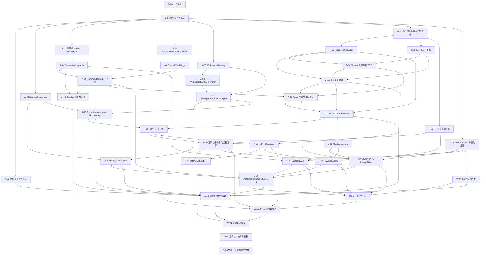

# BBCOM 优化与功能完善执行计划

> 状态：本地可执行范围已收口，发布验收尚未完成。
> 已完成：G-00～G-01、A-01～A-14、P-01～P-02、P-04、P-06～P-07、
> P-09～P-10、U-01～U-08。部分完成：P-03、P-05、P-08、P-11～P-12、
> U-09、Q-01、Q-03。外部阻塞：Q-02。
> 具体差距和恢复条件见“当前收口矩阵”；不得把部分完成项或平台外部验收标记为 `DONE`。
>
> 用途：本文件是插件完善、架构优化和 UI 去重的唯一实施与验收清单。

## 1. 总体目标与固定决策

本计划同时完成三个目标：

1. 完善插件系统，实现应用无重启的安装、启用、停用、更新、回滚、卸载和开发目录热重载。
2. 优化软件架构，建立清晰的 UI、application、domain、infrastructure 边界，消除重复状态和超大服务。
3. 优化 UI，删除重复入口、重复表单、重复状态和重复视觉实现，建立统一组件、主题与可访问性标准。

以下决策已经锁定，实施时不得再次自行变更：

- 不实现插件包签名、TUF、Ed25519、发布者身份认证。
- 不保留插件能力审批、授权弹窗或授权存储。
- Manifest 声明且宿主已支持的能力自动授予；未知能力拒绝加载，已知但尚未实现的能力返回 `unavailable`。
- 保留包和 Wasm 组件 SHA-256 完整性检查；SHA 不代表发布者身份。
- 保留 Wasm 沙箱、OS 沙箱、内存、fuel、epoch、调用超时和应用自身的安装包签名/公证。
- 支持本地包、开发目录和用户配置的无签名 HTTPS 插件源。
- 远程源自动检查更新提示，但下载、安装和切换版本必须由用户手动触发。
- 开发目录 watcher 默认关闭，仅对用户明确启用的开发来源生效。
- 插件全局安装；启用状态和项目状态按 workspace 保存。
- 新安装插件默认不启用；进入 workspace 时自动启动该 workspace 中 `expected_enabled=true` 的插件。
- 串口写入对每个 `workspace + plugin + instance + generation` 只询问一次；批准或拒绝都缓存至该实例结束。
- Disable、崩溃重启、升级、热重载、workspace 切换和卸载都会创建新 generation，并清除旧串口决定。
- 卸载清除包、watcher 和全部私有 `plugin.storage`，并将 workspace 启用状态复位；保留 workspace 中可移植的插件 project state。
- 插件中心是 AppShell 顶层主内容工作区，不再嵌入 Settings。
- 主窗口最低尺寸固定为 960×640；本轮不实现移动端布局。
- 非插件的现有 IPC、workspace 导出格式和串口 wire 行为保持兼容。

首版插件能力范围固定为：

- `ui.panel`
- `plugin.storage`
- `project.settings.read-write`，其展示名称改为“插件项目状态读写”
- `session.metadata.read`
- `session.capture.read`
- `serial.write-proposal`

AI、任意文件访问、剪贴板、通知、直接串口控制等现有已知能力暂不实现，只返回 `unavailable`。

明确不在本轮范围：

- Native 动态库插件。
- 插件自带任意 HTML、JavaScript 或 Vue 页面。
- 私有仓库认证、Cookie、Bearer Token 或带凭据 URL。
- 插件自动下载或自动更新。
- 插件市场发布者认证。
- 移动端 UI。
- 应用自身自动更新系统。

## 2. 执行与状态管理规则

每个工作包使用以下状态：

- `TODO`：尚未开始。
- `IN_PROGRESS`：前置依赖均已完成，正在实施。
- `BLOCKED`：存在明确外部阻塞，必须记录原因和恢复条件。
- `DONE`：实现、迁移、测试、文档和验收要求全部满足。

执行规则：

1. 开始工作包前，确认其所有依赖均为 `DONE`。
2. 每个工作包指定唯一 owner；并行工作不得同时修改同一 composition root。
3. `src/main.ts` 和原生插件 runtime composition 由 A-13/P-08 的集成 owner 统一合入。
4. 不得重置、覆盖或清理当前工作树中的用户修改。
5. 部分已有实现不能直接视为完成，必须重新通过本计划的真实生产链验收。
6. 插件 fake host 测试不能代替真实 installer、resolver、sidecar 和 Tauri capability 测试。
7. 每个工作包完成时在本文件记录完成日期、关联提交、测试命令、结果和已知限制。
8. 对持久化、IPC 或生命周期语义的任何偏离，必须先修改本计划及对应架构文档。
9. 不得通过长期 allowlist、双写或永久兼容 façade 掩盖未完成迁移。

当前收口矩阵，日期为 2026-08-16：

| 状态          | 工作包                                   | 证据或剩余条件                                                                                                                                                                                                                      |
| ------------- | ---------------------------------------- | ----------------------------------------------------------------------------------------------------------------------------------------------------------------------------------------------------------------------------------- |
| `DONE`        | G-00～G-01、A-01～A-14                   | 架构硬门禁扫描 255 个模块、零违规、零循环；Settings、serial、session runtime、workspace gateway/save/transition/UI state 均已收敛为单一 owner；旧 façade、worker persistence 和重复 runtime 已删除。                                |
| `DONE`        | P-01～P-02、P-04、P-06～P-07、P-09～P-10 | Trust/authorization 生产链已删除；无签名 SHA 完整性模型、进程 actor、sidecar 1.2 双向 RPC、instance/generation 绑定 panel/串口真实结果、HTTPS source 与仅 index 自动检查已接通。                                                    |
| `DONE`        | U-01～U-08                               | 统一 token/基础组件、顶层插件中心、全局 PromptHost、会话入口去重、列表组件化、960×640 最低尺寸、focus trap/tab/ARIA/live-region 与 axe gate 已完成。                                                                                |
| `IN_PROGRESS` | P-03、P-05、P-08                         | 热安装/启停/升级/卸载和回滚主链已实现，但仓储仍使用 installer 自身的 `plugins/.staging` 布局，尚未完全迁移为第 3.5 节 `objects/records/journals/tombstones` 固定布局；因此逐 journal 阶段 production 故障注入不能标记完成。         |
| `IN_PROGRESS` | P-11                                     | Native-only dev source watcher、500 ms 稳定读取、SHA 校验、断连健康状态、卸载清理均已实现；当前 installer 仍拒绝“同版本、不同 digest”，稳定热重载需要 manifest 版本增加，尚未满足同版本 dev digest 验收。                           |
| `IN_PROGRESS` | P-12                                     | 旧 publisher 字段仅兼容读取并忽略，旧授权链已删除；旧安装/private state/autostart 到 v2 的带 marker、幂等 journal 全量迁移尚未实现。                                                                                                |
| `IN_PROGRESS` | U-09、Q-01、Q-03                         | Browser mock 两条 Chrome E2E 与真实 axe gate通过；全局覆盖率和 P0 覆盖率通过。Rust workspace coverage 当前为 lines 65.54%、functions 59.97%，未达到 80%/75% 门禁；仍需确定性视觉截图基线及与未完成插件迁移/磁盘事务一致的发布文档。 |
| `BLOCKED`     | Q-02                                     | 当前 Linux 环境不能证明 Windows NSIS、macOS DMG/App 签名/公证和三平台 packaged sidecar；24 小时 soak 也未执行。恢复条件：三平台签名 runner、真实打包产物与连续 24 小时测试窗口。                                                    |

已确认的本地质量基线：

- `scripts/check-architecture.mjs` 检查通过，共扫描 255 个模块，无循环。
- Frontend coverage：statements 86.91%、branches 80.21%、functions 86.46%、lines 89.13%。
- P0 coverage：parser 100/97.76、session-runtime 95.80/90.12、write-scheduler
  98.90/91.18、export-logging 96.33/90.20、ai-security 100/97.30、persistence
  97.73/93.68（均为 lines/branches 百分比）。
- Browser mock E2E：Chrome 2/2 通过，其中 workspace journey 使用真实 axe gate。
- Rust 单元/集成测试、clippy、bindings check 与安全审计通过；`cargo llvm-cov`
  当前为 lines 65.54%、functions 59.97%，尚未达到计划要求的 80%/75%。
- `pnpm audit` 有一个显式忽略的 dev-only `extract-zip` high 公告；公告声称的
  `2.0.2` 修复版本尚未由上游发布，生产依赖不受此项影响。
- 工作树原有大量修改已全部保留，未执行 reset/checkout/clean。

验收证据按以下格式追加：

| 日期       | 工作包         | Owner | 提交           | 命令/场景                                                                                                                                                                                                                                                                                                                                                                                                                                                                               | 结果与限制                                                                                                                                                                                                                                                                                                                                                                                                                                                                                                                                                  |
| ---------- | -------------- | ----- | -------------- | --------------------------------------------------------------------------------------------------------------------------------------------------------------------------------------------------------------------------------------------------------------------------------------------------------------------------------------------------------------------------------------------------------------------------------------------------------------------------------------- | ----------------------------------------------------------------------------------------------------------------------------------------------------------------------------------------------------------------------------------------------------------------------------------------------------------------------------------------------------------------------------------------------------------------------------------------------------------------------------------------------------------------------------------------------------------- |
| 2026-08-16 | G-00           | agent | 未提交(工作树) | `pnpm exec prettier --check AGENTS_PLAN.md`;`pnpm run lint:markdown`                                                                                                                                                                                                                                                                                                                                                                                                                    | 通过;AGENTS_PLAN.md 已加入 package.json format/format:check 与 quality.yml Prettier 列表;实施前 `git status --short` 已记录(大量暂存修改,全部保留)                                                                                                                                                                                                                                                                                                                                                                                                          |
| 2026-08-16 | G-01           | agent | 未提交(工作树) | `pnpm run test:frontend`(131 文件/1034 测试全过);`pnpm run build && pnpm run bundle:check`(gzip 总量 371.11/376 KiB,gate 通过);`pnpm run bench:frontend`(13 项 benchmark 已记录);新增 characterization:`tests/frontend/application-shutdown-bootstrap.test.ts`(workspace-persistence 参与者,2 测试)、`crates/bbcom-plugin-contracts/tests/legacy_publisher_characterization.rs`(3 测试)、`src-tauri/src/plugins/bootstrap/mod.rs` autostart characterization(1 测试)                    | 已确认 workspace/serial/session/settings v1 行为由现有测试充分冻结;Rust bench 与 20 session 内存长稳未在本环境执行,记录为基线缺口,由 Q-02 补齐                                                                                                                                                                                                                                                                                                                                                                                                              |
| 2026-08-16 | A-01           | agent | 未提交(工作树) | `pnpm run architecture:selftest`(10 条期望报告精确匹配);`pnpm run architecture`(235 模块,硬检查通过,25 条 phase-1 报告);已加入 quality.yml                                                                                                                                                                                                                                                                                                                                              | 检查器改为 TS compiler AST + vue/compiler-sfc;新增 cross-feature-public-api、application-no-vue-component、application-no-tauri-sdk、ui-no-direct-tauri、ui-no-serial-sdk、lib-no-reverse-deps、entry-bootstrap-only(报告模式)与 cargo metadata Rust 方向检查;fixture 覆盖全部规则含合法 type-only/dynamic/SFC 导入;当前 25 条违规已稳定列出待后续工作包消化                                                                                                                                                                                                |
| 2026-08-16 | A-02           | agent | 未提交(工作树) | `pnpm run test:frontend`(132 文件/1043 测试);`pnpm exec vue-tsc --noEmit`;`pnpm run build && pnpm run bundle:check`(gate 通过)                                                                                                                                                                                                                                                                                                                                                          | 新建 `src/features/settings/`(GlobalSettingsV2、BrowserSettingsRepository、SettingsService + 进程级单例);app/serial store 不再直接读写 localStorage,v2 key=`bbcom-v2:global-settings`,v1 双 key 只读迁移且永不改写;唯一 300ms debounce 与 shutdown flush 归 SettingsService;写失败 health=failed 可观察可恢复;sidebar 只从 v1 兼容读取不再全局写入;main.ts mount 前 hydrate;AI key 仍仅走 keyring;新增 `tests/frontend/global-settings-service.test.ts`(6 测试)                                                                                             |
| 2026-08-16 | A-03           | agent | 未提交(工作树) | `pnpm run test:frontend`(132 文件/1043 测试);`pnpm run architecture`(240 模块通过);`pnpm run build`                                                                                                                                                                                                                                                                                                                                                                                     | 新建 `SessionMutationRevisionTracker`(markDirty/markDurable/isDirty/clearDirty/reset)替换旧 persistence controller;删除生产不可达的 snapshot serialize/replace/merge host、pagehide/beforeunload/visibilitychange unload flush 与 whenPersistenceReady/flushPersistedSessions/flushFinalPersistence 空 API;shutdown 移除永远 completed 的 session-persistence 空 participant(失败路径测试改用 settings flush 失败驱动);legacy session snapshot 迁移 reader 与 lib 测试保留;workspace save barrier 仍是唯一 durable 边界(markWorkspacePersisted→markDurable) |
| 2026-08-16 | U-01(阶段快照) | agent | 未提交(工作树) | `node scripts/check-css-tokens.mjs`(101 token,0 违规,已入 quality.yml);`pnpm run test:frontend`(1050 测试);`pnpm run lint`;`pnpm run architecture`(246 模块)                                                                                                                                                                                                                                                                                                                            | 本行为实施中阶段快照；后续已完成 naive-theme 语义变量、按钮命中区、字号、AI model menu 与重复 CSS 审计，最终状态以“当前收口矩阵”为准。阶段内完成:静态 CSS token 检查器并修复 7 个组件共 19 处未定义 token;AppSelect 删除无效 menuProps、支持显式 ariaLabel/ariaLabelledby、移除按当前值推断控件名;新建 AppModal/IconActionButton/EmptyState/SettingsSection/ActionListItem/InlineEditorActions(8 个新测试),EmptyState/IconActionButton 已在 PluginCenterPanel 生产采用;架构检查器加组件库入口例外(A-14 移除)                                                |
| 2026-08-16 | P-01(勘察基线) | agent | 未提交(工作树) | 范围勘察:trust 集中在 bbcom-plugin-trust crate 与 src-tauri/plugins/repository;授权面覆盖 contracts/permission.rs、broker/authorization.rs、manager/model.rs、repository install.rs(27 处)、host wiring、command_service/adapter、security/store(711 行)、workspace bindings 与前端 DTO                                                                                                                                                                                                 | 本行为改造前勘察基线；后续已删除 trust/authorization 生产链并完成无签名 SHA 完整性模型，最终状态以“当前收口矩阵”为准。                                                                                                                                                                                                                                                                                                                                                                                                                                      |
| 2026-08-16 | 本地收口验证   | agent | 未提交(工作树) | `pnpm run precommit`;`pnpm run coverage:frontend`;`pnpm run coverage:p0`;`pnpm run e2e:browser:local`;`pnpm run bench:frontend:compare`;`cargo audit --deny unsound --deny yanked`;`cargo run -p xtask -- bindings --check`;`cargo clippy --workspace --all-targets --all-features --locked -- -D warnings`;`cargo test --manifest-path src-tauri/Cargo.toml --workspace --locked`;`cargo llvm-cov --workspace --all-features --locked --fail-under-lines 80 --fail-under-functions 75` | Frontend precommit、1073 测试、coverage/P0、Chrome E2E、3×13 benchmark、Rust audit/bindings/clippy/test 均通过；benchmark 最低基准保持率为 sessions push 97.02%，merged projection 98.98%。Rust coverage 门禁未通过：lines 65.54%、functions 59.97%。因此 Q-01/Q-03 和依赖真实平台的 Q-02 不标记完成。                                                                                                                                                                                                                                                      |

## 3. 目标架构与公共接口

### 3.1 依赖方向

```text
App bootstrap / composition root
  → feature public API
    → UI presenter / adapters
      → application services / controllers
        → domain models + ports
          ← infrastructure adapters

Vue components
  → application facade
    → typed Tauri port
      → PluginRuntimeActor / WorkspaceApplicationService
        → host, repository, SQLite, serial and filesystem adapters
```

禁止的依赖：

- Domain 导入 Vue、Pinia、Naive UI、Tauri 或 serial SDK。
- Application service 导入 Vue component 或直接调用 Tauri SDK。
- UI 直接持有串口、文件路径、SQLite connection、sidecar handle。
- 跨 feature 导入对方私有模块。
- `src/main.ts` 编排具体 workspace 回滚、session runtime 或插件生命周期细节。

### 3.2 插件核心类型

```text
ArtifactDescriptor {
  plugin_id,
  version,
  package_sha256,
  component_sha256,
  source: {
    source_id,
    kind: local-package | dev-directory | https
  },
  declared_capabilities,
  effective_capabilities,
  unavailable_capabilities
}

RuntimeInstanceKey {
  workspace_id,
  plugin_id,
  instance_id,
  generation
}

WorkspacePluginContext {
  workspace_id,
  bindings: [{
    plugin_id,
    expected_enabled,
    version_requirement,
    project_state
  }]
}
```

`publisher.name` 和 `publisher.website` 仅作为插件自述信息。旧 `publisher_identity` 可兼容读取，但必须忽略，且不得参与安装、更新、状态判断或 UI 徽标。

### 3.3 插件快照

`PluginRuntimeSnapshot` 必须是 renderer 的唯一权威数据源，包含：

- 单调递增的 `revision`。
- 当前 workspace ID。
- 全局 source 列表及健康状态。
- Catalog 项和更新候选。
- 全局已安装插件。
- 当前 workspace 的启用状态。
- 每个插件的 lifecycle、原因、当前版本、待切换版本、来源、摘要和 watcher 状态。
- 有界 operation 列表及进度。
- 当前 generation 的首次串口写确认队列。
- 带 `RuntimeInstanceKey` 的声明式 panels。
- 稳定错误码，不包含原生路径、串口 handle 或敏感 project state。

Lifecycle 状态固定为：

```text
disabled | stopped | starting | running |
updating | rolling-back | failed
```

删除 `approval-required` 以及所有 authorization 状态。

### 3.4 Tauri 插件命令

保留 correlation、operation ID、expected revision 和取消机制。命令边界固定为：

```text
plugin_center_snapshot
plugin_request_local_source_grant
plugin_install_local
plugin_install
plugin_update
plugin_uninstall
plugin_set_enabled
plugin_source_add
plugin_source_update
plugin_source_remove
plugin_source_refresh
plugin_set_watch_enabled
plugin_resolve_first_write
plugin_emit_panel_event
plugin_serial_action_result
plugin_cancel_operation
```

规则：

- `plugin_request_local_source_grant` 调用原生目录/文件选择器，只返回短期 opaque grant、显示名称和来源类型。
- `plugin_install_local` 只接受 grant ID，renderer 不传真实路径。
- 只有 source add/update 命令可接收 HTTPS URL；安装和更新只接受 `source_id`、`catalog_id`、`plugin_id` 和版本。
- `plugin_serial_action_result` 返回真实 serial scheduler 的成功、失败、部分写入和 runtime generation，不再使用无结果的 ACK。
- 删除 `plugin_submit_authorization`、`plugin_dismiss_authorization` 及对应 DTO。
- 所有命令仅允许主窗口，并加入 `plugin-main-window.toml` capability。

### 3.5 插件磁盘布局

Native-only 布局固定为：

```text
plugins-v2/
  objects/<package-sha256>/
  records/<plugin-id>.json
  staging/<operation-id>/
  journals/<operation-id>.json
  tombstones/

plugin-state-v2/
  <workspace-id>/<plugin-id>/active/
  <workspace-id>/<plugin-id>/prepared/<operation-id>/

plugin-sources-v2.json
```

约束：

- Installer 和 Host resolver 必须使用同一 canonical package root。
- Project state 只以 workspace SQLite 的 `plugin_project_state` 为权威。
- `plugin-state-v2` 只保存插件私有 `plugin.storage`。
- 更新保留 active 与最近一个 last-known-good 包。
- 所有关键指针使用临时文件、flush/fsync 和原子 rename。
- Journal 完成前不得删除旧版本或旧状态。

### 3.6 远程无签名源格式

Repository index 保持 JSON schema 1，移除发布者身份要求：

```json
{
  "schema": 1,
  "generatedAt": "2026-08-16T00:00:00Z",
  "origin": "https://plugins.example.com",
  "updatePolicy": "manual",
  "plugins": [
    {
      "id": "example.counter",
      "name": "Counter",
      "description": "Example plugin",
      "packages": [
        {
          "version": "1.0.0",
          "url": "https://plugins.example.com/example.counter-1.0.0.zip",
          "sha256": "<64 lowercase hex>",
          "downloadBytes": 1024,
          "expandedBytes": 4096,
          "files": 2
        }
      ]
    }
  ]
}
```

旧 index 中的 `publisherIdentity` 可兼容读取但忽略。新 index 不生成该字段。

### 3.7 新架构端口

本轮必须形成以下稳定端口：

- `SettingsService`：唯一全局设置读写者。
- `SerialConnectionController`：framework-free 串口连接、重连、收发和停止控制器。
- `ValidatedWorkspaceGateway`：无状态、带校验和取消的 native workspace adapter。
- `WorkspaceSaveCoordinator`：唯一 revision、save queue、save health 权威。
- `SessionRuntimeStatusRegistry`：唯一运行状态权威。
- `WorkspaceTransitionParticipant`：session/plugin 在 workspace 切换中的事务参与者。
- `PluginRuntimeActor`：唯一插件生命周期、operation、panel、proposal 和 revision 写入者。

## 4. 总体依赖关系



可并行波次：

| 波次 | 可并行工作包                       | 完成条件                             |
| ---- | ---------------------------------- | ------------------------------------ |
| 0    | G-00、G-01                         | 计划落盘且基线可重复                 |
| 1    | A-01～A-05、P-01、U-01             | 基础边界明确                         |
| 2    | A-06～A-08、P-02、P-03、P-09、U-07 | 单一状态所有者开始形成               |
| 3    | A-09、A-10、P-04                   | 运行时与工作区主链可用               |
| 4    | A-11～A-13、P-05、U-05             | 本地生命周期和 composition root 就绪 |
| 5    | P-06、P-07                         | 新 IPC 和实例安全边界完成            |
| 6    | P-08、U-02                         | 本地真实生产链闭环                   |
| 7    | P-10、P-11、U-03                   | 远程更新、watcher、全局提示完成      |
| 8    | P-12、U-04、U-06                   | 完整插件工作区和重复 UI 清理         |
| 9    | A-14、U-08                         | 架构和可访问性硬门禁                 |
| 10   | U-09、Q-01                         | 自动化集成验收                       |
| 11   | Q-02、Q-03                         | 发布级验收与收口                     |

关键路径：

```text
G-00 → G-01 → P-01 → P-02/P-03 → P-04 → P-05
→ P-06 → P-07 → P-08 → P-10/P-11
→ U-04 → U-06 → U-08 → U-09 → Q-01 → Q-02 → Q-03
```

## 5. 基线与计划治理

### G-00 — 创建并接管 `AGENTS_PLAN.md`

**目标**

将本计划变成仓库内唯一的实施与验收清单。

**实现**

- 在根目录维护 `AGENTS_PLAN.md`。
- 在文件顶部维护状态、owner、提交和验收证据。
- 将 `AGENTS_PLAN.md` 加入 `package.json` 的 `format`、`format:check` 文件列表。
- 将其加入 `.github/workflows/quality.yml` 的 Prettier 检查列表。
- Markdown lint 继续使用现有 `"**/*.md"` 规则。
- 记录实施前 `git status --short`，禁止 reset 或覆盖用户改动。

**依赖**

无。

**验收**

- 根目录仅有一份 `AGENTS_PLAN.md`。
- `pnpm exec prettier --check AGENTS_PLAN.md` 通过。
- `pnpm run lint:markdown` 通过。
- CI 能在故意破坏格式时失败。
- 当前工作树用户修改保持不变。

### G-01 — 基线、characterization tests 与迁移样本

**目标**

冻结现有复杂行为，为重构和迁移建立可比较基线。

**实现**

为以下行为增加或补齐 characterization tests：

- Workspace activate、hydrate、cancel、supersede、rollback、save barrier、readOnly latch。
- Serial open generation、reconnect、RX-before-display、partial write、stop evidence。
- Session create、remove、undo、rebind、capture trim、waveform cursor。
- Shutdown participant 顺序和失败策略。
- 旧 `bbcom-v1:app-settings`、`bbcom-v1:serial-settings`。
- 旧插件 manifest、index、安装记录、autostart、private state、project state、授权数据。
- 当前插件 fake host 和 real sidecar 的行为差异。

保存以下基线指标：

- Frontend benchmark。
- Bundle 大小。
- Serial RX/TX benchmark。
- Workspace activate/save benchmark。
- 20 resident sessions 的内存和操作数。
- 当前完整测试结果。

**依赖**

G-00。

**验收**

- 新 characterization tests 在重构前实现上通过。
- 迁移 fixture 不包含真实用户路径、密钥或业务数据。
- `pnpm run check` 和选定 Rust 测试结果被记录。
- 完整门禁中的既有失败必须记录为基线，不得在后续伪装成新问题。
- 所有后续工作包均可引用稳定 fixture。

## 6. 软件架构优化工作包

### A-01 — 架构检查器报告模式

**目标**

精确发现依赖违规，再在迁移完成后升级为硬门禁。

**实现**

- 将 TypeScript 导入检查改为 compiler AST，支持 `.ts`、type-only import、动态 import 和 Vue SFC。
- 增加规则：
  - 跨 feature 只能导入对方 `index.ts`。
  - Domain 禁止依赖 Vue、Pinia、Naive、Tauri、serial SDK。
  - Application 禁止依赖 Vue component 和 Tauri SDK。
  - UI 禁止直接调用 Tauri 和 serial SDK。
  - `src/lib` 禁止反向依赖 UI/store/Tauri。
  - `src/main.ts` 仅允许 bootstrap 和全局样式。
- 通过 `cargo metadata` 检查 Rust crate 方向。
- 第一阶段仅报告，不允许长期 baseline allowlist。
- 保留 cycle 和 production reachability 检查。

**依赖**

G-01。

**验收**

- Fixture 能覆盖每条允许和禁止规则。
- 合法 type-only、Vue SFC 和动态 import 不误报。
- 当前所有违规都能被稳定列出。
- 报告输出包含来源、目标和违反的规则。

### A-02 — 全局 SettingsRepository

**目标**

消除 app store 与 serial store 对 localStorage 的重复加载、监听和写入。

**实现**

建立：

```text
GlobalSettingsRepository
SettingsService
BrowserSettingsRepository
GlobalSettingsV2
```

`GlobalSettingsV2` 只包含：

- Theme、locale。
- Terminal/display/send defaults。
- Max buffer frames。
- Auto reconnect。
- Selected port 和 serial default config。

明确不包含：

- API key 和 AI 运行状态。
- Sidebar 宽度与折叠状态。
- Session、workspace 和插件数据。

持久化规则：

- 新 key：`bbcom-v2:global-settings`。
- v2 不存在时只读迁移两个 v1 key。
- 逐字段验证并归一化。
- 旧 key 不修改、不删除。
- 只有 `SettingsService` 拥有 300 ms debounce 和 shutdown flush。
- 写失败状态为 `failed`，不得静默退出。

**依赖**

G-01。

**验收**

- v1、损坏字段、部分字段和未来版本 fixture 都安全处理。
- 一次设置修改只产生一次物理写入。
- Theme/locale 在应用 mount 前 hydrate。
- 写失败可观察，重试成功后恢复。
- API key 仍只经过 secure settings/keyring。

### A-03 — 删除旧 session no-op persistence

**目标**

删除已失效但仍参与运行和 shutdown 的旧 session 快照写入骨架。

**实现**

- 用 `SessionMutationRevisionTracker` 替换旧 persistence controller。
- 提供 `markDirty`、`markDurable`、`isDirty`。
- Workspace save 成为 session/document 唯一 durable barrier。
- 删除生产期不可达的 snapshot serialize、replace、merge 和 unload flush。
- 保留只读的 legacy session snapshot migration reader。
- 从 shutdown 删除永远 completed 的空 participant。

**依赖**

G-01。

**验收**

- 正常运行不再写 legacy session snapshot。
- 只有 workspace save 成功才能清除 dirty generation。
- Workspace save 失败继续进入 degraded/readOnly。
- Legacy migration tests 保持通过。
- Shutdown 不重复执行空 barrier。

### A-04 — 抽取 SerialConnectionController

**目标**

将串口连接、重连、RX、TX 和停止语义从 Vue composable 移入 framework-free application 层。

**实现**

建立：

```text
SerialConnectionController
SerialRxPipeline
ReconnectController
SerialPortFactory
PortLeaseClient
TimerPort
VisibilityPort
SerialConnectionSink
```

要求：

- Controller 不得导入 Vue、Pinia、i18n 或 Tauri。
- Tauri serial adapter 位于 infrastructure。
- Raw observer 必须在 display coalescing 前收到数据。
- RX queue、publish cadence、reconnect budget 和 cancellation 各有唯一 owner。
- 错误保持结构化，本地化只在 UI adapter 进行。
- Stop 返回完整、兼容的 shutdown evidence。

**依赖**

G-01。

**验收**

- 现有 serial lifecycle、RX queue、write scheduler 测试通过。
- 新增 open/stop/reconnect 竞态矩阵。
- Partial write、lease conflict、unwatch failure 语义不变。
- Controller 单测无需 Vue、Pinia 或 Tauri 环境。
- Benchmark 相比基线退化不超过 10%。

### A-05 — 无状态 ValidatedWorkspaceGateway

**目标**

删除 WorkspaceCoordinator 与 WorkspaceApplicationService 的重复 active/view/revision 状态。

**实现**

Gateway 负责：

- Request/response/workspace/operation ID 校验。
- DTO sanitization。
- 稳定错误映射。
- `AbortSignal` 取消。
- Catalog、activate、hydrate、batch、flush、export native 调用。

Gateway 不保存：

- Current workspace。
- Revision。
- Save health。
- Catalog view state。
- Activation state。

旧 Coordinator 先委托 Gateway，A-10 后删除其重复状态。

**依赖**

G-01。

**验收**

- Stale 或 mismatched response 必须拒绝。
- 并发请求之间无 active-state 污染。
- Cancellation 与 native terminal outcome 保持。
- 现有 workspace contract tests 全部通过。

### A-06 — Session 内部 store graph 与窄端口

**目标**

保留一个 session 状态图，同时终止所有消费者依赖 60+ 方法 façade。

**实现**

拆分为：

- `SessionMutationGate`
- `SessionCatalogController`
- `SessionCaptureController`
- `SessionDocumentController`
- `SessionSettingsController`
- `SessionWaveformController`
- `SessionMutationRevisionTracker`
- `SessionApplicationService`

公开窄端口：

```text
useSessionCatalog()
useSessionCapture(sessionId)
useSessionDocument(sessionId)
useSessionWaveform(sessionId)
useSessionMutationPolicy()
```

所有端口共享同一批 refs 和 controllers，不得创建第二份 Pinia 状态。

**依赖**

A-03。

**验收**

- Session/frame/waveform ref identity 保持。
- Create/remove/undo/rebind/capture 测试通过。
- Workspace adapter 只依赖 public session port。
- 不产生重复 watcher 或第二份 session state。

### A-07 — Serial Vue/runtime bridge

**目标**

使 `useSerialConnection` 只负责响应式映射与 scope cleanup。

**实现**

- Vue bridge 订阅 `SerialConnectionController` snapshot。
- Capture、auto-log 和 runtime status 通过显式 sink 注入。
- `SessionRuntimeController` 拥有连接控制器生命周期。
- UI mount/unmount 不拥有 resident runtime。
- 原 composable 返回字段保留一轮兼容。

**依赖**

A-04。

**验收**

- UI unmount 不断开 resident session。
- Controller 只创建一次，dispose 幂等。
- Parser、trigger、Modbus raw observer 顺序保持。
- 现有 composable 和 session runtime lifecycle 测试通过。

### A-08 — WorkspaceSaveCoordinator

**目标**

让 workspace revision、save health、save queue 和 capture accounting 只有一个权威。

**实现**

Coordinator 唯一持有：

- Active workspace ID/revision。
- `WorkspaceSaveQueues`。
- `SaveGate`。
- `CaptureAccountingStore`。
- `saveTail`。
- Latched failure/readOnly。
- Unsaved mutation count。

所有物理写入只经过 A-05 Gateway。

保持既有批处理：

- Config debounce 300 ms。
- Frame flush 250 ms。
- 每批最多 256 frames 或 512 KiB。
- Ordered mutation 与 frame queue 的 happens-before 关系不变。

**依赖**

A-05。

**验收**

- Failure latch 后拒绝新写入。
- Flush/export 使用同一 revision。
- Trim/reset/waveform ingest 仍为原子 batch。
- Save 成功、失败、取消和 shutdown 测试全部通过。

### A-09 — SessionRuntimeStatus 单一权威

**目标**

消除 `serial.isConnected`、session document 和 UI 自身连接状态的分叉。

**实现**

建立：

```text
SessionRuntimeStatus {
  phase,
  droppedBytes,
  failure
}

SessionRuntimeStatusRegistry
```

- Serial bridge 负责发布状态。
- Tabs、toolbar、status bar、AI bridge、Modbus guard 全部改读 registry。
- Workspace/session document hydrate 后始终为 stopped。
- 旧 `isConnected` 字段兼容读取但忽略。
- 迁移期间只允许从 registry 向旧字段单向 projection。

**依赖**

A-06、A-07。

**验收**

- 任意 UI 位置显示同一 phase。
- Workspace restore 不出现虚假的 connected。
- Connecting/reconnecting/closing 状态不分叉。
- 旧 snapshot 正常读取且强制 stopped。

### A-10 — WorkspaceActivationEngine

**目标**

将超大 WorkspaceApplicationService 拆成可独立测试的激活状态机和薄 façade。

**实现**

激活顺序固定为：

1. Freeze 用户 mutation。
2. Drain A-08 save coordinator。
3. Quiesce runtime participants。
4. 执行 native activation。
5. Stage 并验证 hydration。
6. Dispose previous participants。
7. 原子替换 session façade。
8. 开启新 save epoch。
9. Participants `activateStopped`。
10. Commit transition。

失败时：

- 恢复 native workspace。
- 按逆序 restore participants。
- 恢复旧 save epoch。
- Rollback 本身失败则进入 recovery lockout。

**依赖**

A-05、A-08。

**验收**

- Cancel、supersede、hydrate failure、rollback 矩阵通过。
- Session façade 只同步替换一次。
- 失败后旧 workspace 可继续保存。
- Export snapshot 与 save barrier revision 一致。

### A-11 — WorkspaceUiStore

**目标**

删除 sidebar layout 在全局 localStorage 和 workspace SQLite 中的双写。

**实现**

- `WorkspaceUiStore` 唯一拥有 `WorkspaceLayoutV1`。
- Workspace hydration 负责 apply。
- Sidebar resize/collapse 只生成 workspace metadata mutation。
- A-02 settings 永不包含 sidebar。
- 新 workspace 使用 `DEFAULT_WORKSPACE_LAYOUT`。
- 旧 global sidebar 字段只兼容读取，不迁入 v2，也不覆盖 workspace layout。

**依赖**

A-02、A-10。

**验收**

- 不同 workspace 保留不同 layout。
- 切换时不闪回旧全局值。
- 一次 resize 只产生一个 workspace mutation。
- 不产生 global settings 写入。

### A-12 — Session 调用方迁移与旧 runtime 删除

**目标**

完成 session feature 边界，删除重复 runtime 和 compatibility graph。

**实现**

- 所有消费者只通过 `features/sessions/index.ts` 导入。
- `useSessionActions` 委托 `SessionApplicationService`。
- `ApplicationRuntimeRegistry` 成为唯一 resident runtime registry。
- 删除旧 `SessionRuntimeManager`、`session-residency` 和已无调用方的 façade。
- 测试直接验证生产 registry。

**依赖**

A-06、A-09。

**验收**

- 生产代码中没有旧 runtime 引用。
- 无跨 feature 私有 session import。
- Tab switch、remove/undo、workspace reconcile 测试通过。
- Bundle 中不再包含旧 runtime graph。

### A-13 — WorkspaceTransitionParticipant 与 bootstrap 收敛

**目标**

把 workspace/session/plugin transaction 从 `src/main.ts` 移入 application 层。

**实现**

建立：

```text
WorkspaceTransitionParticipant {
  id,
  quiesce(ctx),
  dispose(ctx),
  restore(ctx),
  activateStopped(ctx),
  commit(ctx)
}
```

`WorkspaceTransitionCoordinator` 必须：

- 固定顺序执行。
- 记录每个 participant 已完成的 phase。
- 失败时逆序恢复。
- 对同一 transition ID 幂等。

实现：

- `SessionRuntimeWorkspaceParticipant`
- `PluginRuntimeWorkspaceParticipant`

`src/main.ts` 最终只负责：

- 判断窗口。
- 创建 Vue/Pinia。
- Hydrate settings。
- 创建 application services。
- 注册 providers/participants。
- Bootstrap shutdown。
- Mount 和统一 teardown。

**依赖**

A-02、A-09、A-10。

**验收**

- 任意 participant 中途失败时正确逆序恢复。
- Transition 重试不重复 dispose/start。
- `src/main.ts` 不再包含具体 rollback 和 runtime snapshot 逻辑。
- 应用启动失败进入明确状态，不出现空白窗口。

### A-14 — 架构硬门禁与兼容清理

**目标**

将报告模式转为 CI hard fail，并删除迁移后的重复实现。

**实现**

- 启用 A-01 的全部规则。
- `pnpm architecture` 同时执行 TS 和 Rust dependency checks。
- 删除已无调用方的 deprecated exports、旧 tests 和 compatibility members。
- 不使用逐文件永久 allowlist。
- 大文件行数仅报告，不作为任意硬阈值。
- 保留明确需要一轮发布周期的只读迁移 reader。

**依赖**

A-01、A-11、A-12、A-13、P-07、U-06、U-07。

**验收**

- 当前生产源码零架构违规。
- 每条规则都有失败 fixture。
- Quality workflow 将 architecture 设为 required。
- Cycle、orphan、production reachability 保持有效。
- 非插件 IPC、workspace schema、导出格式和串口 wire 行为未改变。
- Frontend benchmark 和 serial benchmark 退化均不超过 10%。

## 7. 插件功能完善工作包

### P-01 — 重置插件契约、身份与能力模型

**目标**

彻底断开签名、发布者身份和能力审批，同时保留完整性与沙箱。

**实现**

- `PluginArtifact` 改用包 SHA、组件 SHA、来源和能力计划。
- 引入 `CapabilityPlan { effective, unavailable }`。
- 支持能力自动进入 HostHello grants。
- 已知未实现能力进入 unavailable，未知能力拒绝 manifest。
- 旧 `publisher_identity` 兼容读取但忽略。
- 从 workspace、Cargo 依赖和生产组合删除 `bbcom-plugin-trust`。
- 删除 `AuthorizationKey`、`AuthorizationBroker`、授权 receipt、revocation store、security store。
- `bbcom-plugin-broker` 只保留 panel、proposal、validation 和 audit。
- 应用安装包签名和 sandbox 配置不变。

**依赖**

G-01。

**验收**

- 正确 SHA 的无签名包可准备安装。
- 包或组件 SHA 错误必须失败。
- 改变 publisher 自述信息不再触发身份变化。
- `cargo tree` 中生产图不存在 trust/auth store。
- UI/DTO 不存在 verified publisher。
- 未声明或未实现能力不能进入 host grants。

### P-02 — 进程级单一 PluginRuntimeActor

**目标**

消除 manager、adapter、command service 和 autostart 的多份插件状态。

**实现**

Actor 唯一持有：

- Installed records。
- Active workspace context。
- Runtime instances。
- Panels 和 first-write reviews。
- Sources、catalog 和 watcher 状态。
- Operations 和单调 revision。

所有 Tauri command、host exit、watcher 和 update check 都发送 actor message。

并发约束：

- Host、网络、文件任务在 worker/supervisor 执行。
- Actor 使用有界 channel。
- Actor 不得持锁等待 sidecar。
- Active operations 上限 128。
- 已完成 operation ring 上限 256，保留 15 分钟后淘汰。
- Terminal correlation 必须释放，不能在约 1024 次操作后耗尽。

删除：

- 全局 `plugins-autostart.json` 作为运行权威。
- `enabled_overrides`。
- Workspace 切换时的 runtime/command-service 重建。

**依赖**

P-01。

**验收**

- Workspace A/B 启用状态互不影响。
- Workspace 切换后 revision 严格递增。
- 无 workspace 时仍能浏览、安装和卸载。
- Actor 外没有 lifecycle、panel、proposal 或 enabled 可变缓存。
- 5000 次完成操作不会耗尽 operation registry。
- Sandbox self-test 每进程只执行一次。

### P-03 — 统一包根、状态端口和可恢复事务

**目标**

修复 installer/resolver 根不一致、private/project state 混用和升级非原子问题。

**实现**

- 使用第 3.5 节统一布局。
- Project state 只经 workspace native port 读写。
- Private storage 支持 active/prepared clone、promote、discard、restore。
- 更新 journal 固定阶段：

```text
prepared
→ preflighted
→ old-stopped
→ artifact-activated
→ state-promoted
→ workspace-committed
→ new-started
→ complete
```

- Preflight 禁止写 active project state 或执行串口副作用。
- 卸载先停 watcher/host，再将 package 和 storage rename 到 tombstone。
- 逻辑提交后异步删除；提交前失败恢复旧路径。
- 保留最近一个 last-known-good artifact/state。

**依赖**

P-01。

**验收**

- Production resolver 可启动 active 和 prepared 包。
- 每个 journal 阶段故障注入后，只能恢复完整旧版本或完整新版本。
- Preflight 不污染 active storage/project state。
- 卸载不先丢失安装记录。
- Project state 在卸载后保持。

### P-04 — Sidecar 双向能力 RPC

**目标**

接通真实 session、capture、serial proposal、初始 panel 和 panel-event 回程。

**实现**

- Host protocol minor 递增。
- 所有请求携带 `RuntimeInstanceKey`。
- Transport 多路复用 guest response 与 HostCall。
- 增加：
  - `session-list`
  - `capture-read`
  - `propose-serial-send`
  - `initialize`
  - `invoke-panel-event`
- 每个调用设置 deadline、消息大小、分页、HostCall 次数和取消限制。
- Actor 等待 guest 时仍能处理 HostCall，避免双向 RPC 死锁。
- Session/capture 只能读取当前 workspace 已提交数据。
- Project/private state 在 guest 调用边界持久化。
- Preflight 模式禁止 serial side effect。

**依赖**

P-02、P-03。

**验收**

- Real sidecar 能读到非空 session metadata 和 capture page。
- Initialize panel 直接出现在 snapshot。
- Panel event 到达准确 instance 并返回新 panel/state。
- Serial proposal 到达 actor。
- Timeout、乱序、超限和 stale instance 全部 fail closed。
- 新旧协议不兼容时握手失败，不降级为 stub。

### P-05 — 本地安装、启停、更新、回滚和卸载

**目标**

实现无需重启应用的完整本地热插拔生命周期。

**实现**

- 使用原生 picker 和单次 opaque grant。
- 安装全局记录，当前 workspace 默认 disabled。
- 显式 enable 后启动。
- Workspace 激活后启动 `expected_enabled=true` 的已安装插件。
- 更新流程：
  - Stage。
  - SHA 验证。
  - Clone private state。
  - Prepared preflight。
  - 停旧实例。
  - 原子提交。
  - 启动新实例。
- 任一阶段失败时自动恢复旧包、旧 private state、旧 project state 和旧实例。
- 远程更新要求版本增加。
- Dev-directory 允许同版本、不同 package SHA。
- 每次启动、崩溃恢复、升级、watch reload 均创建新 generation。
- Disable/uninstall 清理旧 panel、proposal 和 runtime consent。

**依赖**

P-02、P-03、P-04。

**验收**

- Install、enable、disable、update、uninstall 均不重启应用。
- 每个插件最多一个 active instance。
- Prepared instance 可并存但没有外部副作用。
- 更新成功时 state 连续，失败时旧版本继续运行。
- 同版本同 SHA 为 no-op。
- 同版本不同 SHA 仅 dev-directory 可接受。
- 卸载后重装可重新读取保留的 workspace project state。

### P-06 — Panel 实例绑定与首次串口写确认

**目标**

阻止 stale UI 操作新实例，并实现每 generation 仅确认一次的串口写入。

**实现**

- Panel、event、proposal 都携带完整 `RuntimeInstanceKey`。
- Actor 只接受当前 instance/generation。
- 每个 generation 的第一条有效 proposal 进入全局确认队列。
- 批准和拒绝都缓存：
  - 批准后后续 proposal 自动进入 serial scheduler。
  - 拒绝后后续 proposal 自动拒绝，不重复弹窗。
- 用户可通过 disable→enable 创建新 generation 重新决定。
- 每次 proposal 仍校验：
  - 载荷和帧数上限。
  - Session 存在且已连接。
  - Serial runtime generation。
  - Operation/correlation。
- Renderer 完成真实写入后，通过 `plugin_serial_action_result` 返回结果。
- Disable、crash、update、reload、workspace switch、uninstall 立即撤销旧决定。

**依赖**

P-04、P-05、A-09。

**验收**

- 同 generation 连续两次写只弹一次。
- 首次拒绝后同 generation 不再弹窗且不发送。
- 新 generation 再次提示。
- Stale proposal/event、重复 resolve、过期 review 均不能执行。
- Session 断开或 generation 变化后自动通过的 proposal 仍被拒绝。
- Panel 在停用或卸载后的同一快照 revision 中消失。

### P-07 — IPC、Tauri capability 与前端领域契约

**目标**

使 renderer 只面对一个与新生命周期一致的命令和快照边界。

**实现**

- 删除 authorization review、decision、risk combination 和相关状态。
- 更新 Rust DTO、生成 TypeScript、frontend port 和 service。
- 增加 source、watch、update、operation、instance-bound panel、first-write review。
- 补齐所有命令的 main-window capability。
- `plugin-center-changed` 成为 revisioned snapshot 推送事件。
- Renderer 不接收真实路径、sidecar handle、SQLite connection 或任意临时安装 URL。
- Rust DTO、生成 TS 和 frontend service 必须在同一提交切换。

**依赖**

P-02、P-05、P-06。

**验收**

- 每个注册命令都有真实 Tauri main-window command test。
- 非主窗口调用全部拒绝。
- Workspace 切换后 frontend 接受更高 revision。
- Generated bindings check 通过。
- 源码中 authorization 命令、类型、store、dialog 均不可达。
- `plugin-main-window.toml` 不再遗漏 install、update、uninstall 和 serial result。

### P-08 — 本地热插拔生产链门禁

**目标**

证明本地热插拔运行在真实 production graph，而不是 fake ports。

**实现**

使用：

- 真实 installer/resolver。
- 真实 sidecar fixture。
- 临时 app-data/workspace。
- Tauri command boundary。
- 故障注入器。
- Session/capture/serial mock runtime，但保持真实 application port。

完整场景：

```text
选择来源
→ 安装
→ workspace 启用
→ initial panel
→ panel event
→ session/capture
→ 首次串口确认
→ 后续写入
→ 停用
→ 重启应用恢复
→ 更新/回滚
→ 卸载
```

**依赖**

P-01～P-07、A-13。

**验收**

- Production artifact root、Tauri capability、sidecar handshake 全部覆盖。
- Workspace A/B 启用隔离和 revision 单调通过。
- 1.0→1.1、同版本 dev digest 变化和失败回滚通过。
- 卸载清包/watcher/private storage，保留 project state。
- 失败后无需重启应用。
- Trust/auth 静态检查为空。
- Sandbox、memory、fuel、epoch、timeout 测试继续通过。

### P-09 — 用户配置的 HTTPS 无签名来源

**目标**

提供安全边界明确、但不认证发布者的远程插件源。

**实现**

Source registry 持久化：

```text
source_id
url
enabled
last_attempt
last_success
health
etag
last_modified
```

网络规则：

- 仅 HTTPS。
- 禁止 credentials、query、fragment 和 IP literal。
- 每次请求重新解析 DNS。
- 拒绝 loopback、link-local、private、reserved 地址。
- Redirect 最多 5 次且必须同 origin。
- 不发送 Cookie、认证头或 renderer 自定义 header。
- Index 最大 4 MiB。
- Package 必须匹配 index 中的 URL、长度和 SHA。
- Package 继续使用现有限额。
- 保留 last-known-good index。
- 安装记录绑定原 source ID；换源必须显式执行。

**依赖**

P-01、P-03。

**验收**

- 错误 SHA、超限、私网 DNS、跨 origin redirect、重复版本均拒绝。
- 删除或禁用 source 不影响已安装插件运行。
- Renderer 提供的临时 package URL 不能进入下载路径。
- UI 不显示 publisher verified/unverified。
- HTTPS/SHA 文案不暗示签名认证。

### P-10 — 自动检查提示与手动远程更新

**目标**

自动发现更新，但绝不自动下载或安装。

**实现**

- 应用启动时，如果距上次检查达到 24 小时，则刷新一次。
- 应用持续运行时每 24 小时检查一次。
- 用户可关闭自动检查，并可随时手动刷新。
- 使用 ETag/Last-Modified 条件请求。
- 后台检查只下载 index。
- 只接受原 source 中的更高 semver。
- 远程同版本不同 SHA 标为 source conflict，不提供普通更新。
- 用户点击更新后复用 P-05 事务。

**依赖**

P-08、P-09。

**验收**

- 未点击更新前，不下载 package，不改变 host、artifact 或 state。
- 离线/超时只更新 source health。
- 更新成功后 workspace 启用状态不变。
- 更新失败时旧版本继续运行。
- 自动检查关闭后只响应手动刷新。

### P-11 — 开发目录 watcher 热重载

**目标**

开发目录稳定变化后自动执行安全热重载。

**实现**

- 只监听显式 `dev-directory` 来源。
- Watcher native-only，renderer 不接收路径。
- 使用 500 ms debounce。
- Manifest 和 component 必须连续两次稳定读取，两次间隔 250 ms。
- SHA 必须匹配 manifest 后才生成 deterministic package。
- 不修改开发目录或自动重写 manifest。
- 快速连续变化只保留最新 digest。
- 更新进行中最多保留一个 pending digest。
- Disabled 插件可更新 artifact，但不得自动启用。
- 来源缺失标为 disconnected，保留已安装包。
- Uninstall 在提交前停 watcher 并删除注册。

**依赖**

P-05、P-08。

**验收**

- 稳定修改无需重启应用即可切换 generation。
- Reload 后重新触发首次串口确认。
- 半写文件、SHA 不匹配和写入风暴不会停止旧实例。
- Uninstall 后修改原目录不会产生 actor event。
- 重启应用可恢复仍启用的 watcher。
- Watcher 可按 source 关闭。

### P-12 — 旧插件数据迁移与收口

**目标**

安全迁移现有安装、状态和 autostart，同时清理失效授权数据。

**实现**

迁移必须有持久 marker 和幂等 journal：

- 旧安装记录迁移为：
  - `source.kind=local-package`
  - `source.id=local-legacy`
  - 从实际包计算 SHA。
  - 初始 lifecycle 为 stopped。
- 旧 `plugin-state-v1` 的有效 private storage 迁入 v2。
- Project state：
  - Workspace SQLite 已有值时优先。
  - 数据库无值时才导入旧副本。
  - Workspace commit 成功后才删除旧副本。
- 旧全局 autostart：
  - 映射到迁移时第一个成功激活 workspace 的 `expected_enabled`。
  - 其他 workspace 默认 false。
  - 映射完成后不再读取全局 autostart。
- 旧授权/keyring/security 数据不读取。
- 迁移 marker 成功后清除旧授权数据。
- v1 包和状态目录保留一个稳定版本作为降级保护。
- 无法更新的 workspace 记录 pending normalization；重新打开时将已卸载插件的 `expected_enabled` 复位为 false。

**依赖**

P-10、P-11。

**验收**

- 所有迁移 fixture 可重复运行且结果相同。
- 中途崩溃不会得到半迁移安装或状态。
- 旧授权永不影响新 runtime。
- 已卸载插件重装后不会因遗留 autostart 自动启用。
- Project state 在迁移和卸载后保持。
- 降级保护目录在本版本不会被提前删除。

## 8. UI 优化与重复 UI 清理工作包

### U-01 — 统一 design tokens 与基础组件

**目标**

消除三套颜色变量和大量重复交互组件。

**实现**

- `variables.css` 成为唯一 semantic token 来源。
- Naive theme override 引用 semantic variables。
- 删除插件组件中的未定义 token。
- 增加静态 CSS variable 检查。
- 建立：
  - `AppModal`
  - `IconActionButton`
  - `EmptyState`
  - `SettingsSection`
  - `ActionListItem`
  - `InlineEditorActions`
- Icon button hit area 至少 28×28 px。
- 正文最小 12 px；仅次要 metadata 可使用 11 px。
- 修正 `AppSelect`：
  - 删除无效 `menuProps`。
  - 支持显式 `ariaLabel`/`ariaLabelledby`。
  - 禁止用当前选项值推断控件名称。
- 删除 AI model menu 的失效配置和重复 CSS。

**依赖**

G-01。

**验收**

- 静态检查不存在未定义 CSS token。
- Light/dark 下组件语义颜色一致。
- 所有 icon-only 按钮都有可访问名称。
- Export select 被读为“格式/方向/范围”，而不是当前值。
- AppSelect 和 AI 现有测试通过。

### U-02 — App-scoped Plugin Presenter

**目标**

使插件状态独立于插件工作区是否挂载，并消除重复 start/subscription。

**实现**

- App bootstrap 只启动一次 `PluginCenterService`。
- Presenter 只建立一次 snapshot subscription。
- Workspace 和 PromptHost 使用同一 readonly snapshot/action façade。
- Action 带 target：
  - Plugin。
  - Source。
  - Operation。
  - Global。
- Busy 只锁定冲突行，不全局冻结插件中心。
- Plugin workspace 关闭时仍接收 runtime、watcher 和 update 事件。

**依赖**

P-07。

**验收**

- 应用中只有一次 service start 和一次 presenter subscription。
- 工作区关闭时热更新，重新打开立即显示最新 revision。
- 不产生重复提示、刷新或 action。
- 不相关插件可以并行执行无冲突操作。

### U-03 — 全局首次串口写入 PromptHost

**目标**

确保插件工作区关闭时仍能处理首次串口写确认。

**实现**

- 在 AppShell 顶层常驻 `PluginPromptHost`。
- 只处理 `firstWriteReviews`，不包含能力授权。
- 多个插件 review 按 actor sequence FIFO。
- 一次只显示一个 modal。
- Busy 时禁止重复提交和误关闭。
- Review 过期、实例退出或卸载后立即移除。
- 使用 `AppModal/NModal`，删除自制 `AccessiblePluginDialog`。
- 删除 `PluginAuthorizationDialog`。
- 文案明确“仅适用于当前插件运行实例”。

**依赖**

U-01、U-02、P-06。

**验收**

- Settings 和插件工作区都关闭时仍可看到 first-write review。
- 同一 generation 最多提示一次。
- 多个 review 不堆叠、不跳序、不重复。
- Enter、Escape、Tab、Shift+Tab 和焦点恢复正确。
- Stale review 不可提交。
- 卸载后不遗留 modal。

### U-04 — 顶层插件主内容工作区

**目标**

用一套可持续操作的插件工作区替代 Settings 中的插件面板。

**实现**

AppShell 增加顶层 workspace mode：

```text
sessions | plugins
```

插件工作区包含：

1. `Installed`
   - 全局安装列表。
   - 当前 workspace 启用状态。
   - Lifecycle、原因、版本、pending version、来源、SHA、能力和 watcher 状态。
   - Enable、disable、update、rollback retry、uninstall、cancel。
2. `Catalog`
   - 聚合启用的 HTTPS sources。
   - 显示可安装版本和更新候选。
   - 安装/更新必须由用户点击。
3. `Sources`
   - 添加、编辑、启用、禁用、删除、刷新 HTTPS source。
   - 选择本地 package 或 dev directory。
   - 开关 watcher 和显示断开/错误状态。
4. `Panels`
   - 当前 workspace 运行实例的声明式 panels。
   - Panel key 使用完整 `RuntimeInstanceKey`。

界面规则：

- 从 Settings 完全删除插件管理。
- 不保留第二个可操作入口。
- 本地安装不显示路径输入框。
- 不显示 publisher verified/unverified。
- 只在 Sources 说明一次“插件未进行签名认证，SHA 仅用于完整性”。
- 每行显示独立进度、失败、重试和取消。
- Installed/Catalog 达到 100 项时使用虚拟列表。
- 切换回 sessions 不停止插件 runtime。

**依赖**

U-01、U-02、P-09、P-10、P-11。

**验收**

- Settings 中不存在插件安装、启停、更新或面板。
- 唯一插件工作区可完成全部 lifecycle/source/watch/panel 操作。
- Disable/uninstall 后 panel 在同一 revision 消失。
- 100 个插件不会撑破页面或触发全窗口滚动。
- 操作失败只影响目标行。
- Light/dark 和 960×640 均可使用。

### U-05 — 创建会话流程去重

**目标**

项目中只保留一套端口选择和串口配置表单。

**实现**

- `CreateSessionDialog` 成为唯一配置状态所有者。
- 将端口刷新、无端口、占用状态合并到该对话框。
- 删除 `PortSelector` 的：
  - 直接创建入口。
  - 串口配置表单。
  - 配置 summary。
- 若不再承担独立职责，删除整个 `PortSelector` component。
- AppShell 提供唯一 `requestCreateSession(preferredPort?)`。
- SessionTabs “+”、空状态 CTA、Ctrl+N 均调用该方法。
- 只有 Confirm 执行 `createSession`。
- 保留 presets、DTR/RTS、frame gap 和端口占用校验。
- Checksum 工具迁到 Tools。
- 删除空会话状态中的 Ctrl+W 提示。

**依赖**

U-01、A-06。

**验收**

- 源码和 DOM 中只有一套串口配置表单。
- 三个入口打开同一 dialog，并获得相同默认值。
- Cancel 不创建，Confirm 只创建一次。
- 已占用端口不可选。
- 热拔出端口后状态及时更新。
- ReadOnly 模式不能创建。
- Preset 行为保持。

### U-06 — AppShell、Settings、Workspace、Tabs 和 StatusBar 去重

**目标**

删除同屏重复信息并建立明确的信息所有权。

**实现**

- Settings 只保留外观、采集、连接、关于。
- `NSwitch` 使用 `value/update:value`，修复 auto reconnect。
- 删除 sidebar 的语言、主题快捷按钮。
- 保留唯一 Settings 齿轮和独立 AI 开关。
- Workspace header 显示当前项目；Recent 列表过滤当前项目。
- StatusBar：
  - 删除独立 frames mini-stat。
  - 删除尾部连接圆点。
  - 保留 screen-reader live region。
  - 建立唯一 `DataLossIndicator`，汇总 serial queue dropped bytes 和 capture evicted frames。
- Toolbar 删除重复的数据丢失常驻提示。
- SessionTabs 连接状态只保留圆点，删除绿色渐变和左边框。
- Tauri window 设置 `minWidth=960`、`minHeight=640`。
- 960 宽时 sidebar 默认可折叠，主区不得产生负宽或不可达控件。

**依赖**

U-03、U-04、U-05、A-09、A-11。

**验收**

- 当前项目、当前 frames 和连接圆点不重复显示。
- Theme/locale 只有一个设置入口。
- 使用真实 Naive `NSwitch` 修改 auto reconnect 后立即生效并持久化。
- 数据损失只有一个状态入口，且来源可区分。
- 960×640 无工具栏覆盖和意外横向滚动。

### U-07 — Macro、Trigger、Highlight 列表组件化

**目标**

删除三套重复列表行、编辑按钮、空状态和表单动作 CSS。

**实现**

- Macro、Trigger、Highlight、ToolsTabs 使用 U-01 primitives。
- Add/edit/save/cancel/delete 顺序一致。
- Danger、disabled、focus-visible 一致。
- 只共享视觉组件，不合并三套业务模型、验证和 store。
- 删除无调用方的重复 CSS。

**依赖**

U-01。

**验收**

- 三类工具操作布局和键盘顺序一致。
- 所有编辑流程可仅用键盘完成。
- 删除操作的危险色、确认和 disabled 语义一致。
- 原业务功能测试无行为变化。

### U-08 — 可访问性闭环

**目标**

完成键盘、语义、焦点、状态通知和对比度的统一验收。

**实现**

- Toolbar 四种视图采用 radio 或明确 `aria-pressed`。
- Auto-scroll、ANSI、line-break、timestamp、auto-log 暴露当前状态。
- 插件 tabs 支持 Left/Right、Home/End 和 roving tabindex。
- SessionTabs 增加 `Alt+Shift+Left/Right` 键盘重排。
- 重排结果通过 live region 报告。
- 所有 modal 验证初始焦点、trap、Escape、busy 和焦点恢复。
- 所有 AppSelect 显式命名。
- Axe 场景覆盖：
  - Create Session。
  - Plugin Installed/Catalog/Sources/Panels。
  - First-write review。
  - Export。
  - Tools 编辑。
  - Hot disable/uninstall。
- 删除 authorization 场景和旧自制 focus trap 测试。

**依赖**

U-03、U-04、U-05、U-06、U-07。

**验收**

- 关键流程 axe serious/critical 为 0。
- 所有主要操作可仅用键盘完成。
- Select、toggle、tab 的名称和状态稳定正确。
- Prompt、连接变化、数据损失、重排各只播报一次。
- Focus 在热卸载或删除行后落到相邻行或空状态。

### U-09 — 确定性 browser fixture 与视觉回归

**目标**

将新布局、主题、重复 UI 删除和插件热插拔状态纳入持续回归。

**实现**

- 扩展现有 WebdriverIO browser-mock fixture。
- 固定时间、端口、session、frame rate、workspace、plugins 和 source 数据。
- 保持真实组件树，只替换原生边界。
- 建立截图基线和审核更新流程。
- 动态时间、速率区域固定或显式 mask。
- 矩阵：
  - Light/dark。
  - 960×640、1024×768、1280×800。
  - Empty、connected、disconnected、readOnly。
  - Create session。
  - Plugin empty、installed、busy、failed、update available、watch reload。
  - First-write approve/reject。
  - Tools editing。
- 同一 fixture 执行 axe、DOM 和 overflow 检查。
- Native E2E 只验证 picker、window min size 和真实 hotplug event chain。

**依赖**

U-08、P-08、P-10、P-11。

**验收**

- 固定 Linux runner 和字体环境下截图可重复。
- Mask 后像素差异不超过 0.1%。
- 所有目标尺寸无意外横向滚动。
- Hot install/enable/update/disable/uninstall 同时有截图和 DOM 断言。
- 视觉、axe、browser smoke 纳入 frontend quality gate。

## 9. 集成、质量与发布门禁

### Q-01 — 全量集成验收

**目标**

证明所有工作包在同一生产组合中协同工作。

**实现与命令**

至少执行：

```sh
pnpm run toolchain:check
pnpm run lint
pnpm run lint:markdown
pnpm run lint:shell
pnpm run format:check
pnpm run architecture
pnpm run build
pnpm run bundle:check
pnpm run test:frontend
pnpm run e2e:browser:local
cargo run -p xtask --locked -- bindings --check
cargo fmt --manifest-path src-tauri/Cargo.toml -- --check
cargo clippy --manifest-path src-tauri/Cargo.toml --workspace --all-targets --all-features --locked -- -D warnings
cargo test --manifest-path src-tauri/Cargo.toml --workspace --locked
pnpm run precommit:full
```

增加端到端矩阵：

- Settings v1→v2。
- Create session→connect→send→receive。
- Tab 切换保持 runtime。
- Workspace switch 成功、失败和 rollback。
- Plugin local、remote、watcher lifecycle。
- First serial write approve/reject。
- Shutdown 时 settings/workspace/plugin journal flush。

**依赖**

A-14、P-12、U-09。

**验收**

- 所有命令通过。
- Coverage 门禁不下降。
- Bundle gate 通过。
- Generated bindings 无差异。
- 无 trust/auth production dependency。
- 无空 Catalog、stub capability 或假成功 lifecycle。
- `AGENTS_PLAN.md` 中所有前置包均记录验收证据。

### Q-02 — 三平台、故障注入、性能与长稳

**目标**

证明 Windows、macOS、Linux packaged 应用在真实故障下仍可恢复。

**实现**

平台矩阵：

- Windows NSIS。
- macOS DMG/App。
- Linux AppImage/DEB。

故障矩阵：

- 每个 plugin journal 阶段崩溃。
- 磁盘满、权限拒绝、只读 workspace。
- 网络离线、超时、错误 SHA、DNS rebinding、redirect 攻击。
- Sidecar crash、timeout、malformed HostCall。
- Watcher 写入风暴、半写文件和来源消失。
- Workspace 快速切换、取消和 rollback failure。
- Stale panel/proposal/serial result。
- 应用 shutdown 中途退出。

压力矩阵：

- 20 resident serial sessions。
- 100 installed plugins。
- 20 running plugin sidecars 或平台允许的上限。
- 5000 lifecycle operations。
- 连续 workspace A/B 切换。
- 24 小时 watcher/source/host crash soak。

**依赖**

Q-01。

**验收**

- 三平台 packaged sidecar 可启动。
- OS sandbox self-test 通过。
- 应用签名/公证流程不受影响。
- 无线程、operation、proposal、panel、watcher、tombstone 泄漏。
- 无 unbounded collection。
- Serial/frontend benchmark 退化不超过 10%。
- 任一失败后得到完整旧状态或完整新状态，不出现半提交状态。

### Q-03 — 文档、死代码与发布收口

**目标**

删除无用实现，统一文档，并形成可发布状态。

**实现**

更新：

- `README.md`、中文 README。
- `ARCHITECTURE.md`。
- `SECURITY.md`。
- `CONTRIBUTING.md`。
- 插件 contracts/host/manager/repository README。
- `CHANGELOG.md`。
- Release 和 plugin market gate 文档。

文档必须明确：

- 插件不做签名或发布者认证。
- SHA 只验证完整性。
- 支持的能力和 unavailable 能力。
- 全局安装、workspace 启用规则。
- 首次串口写确认范围。
- HTTPS source 安全限制。
- Watcher 仅用于显式 dev-directory。
- 卸载数据策略和迁移策略。

删除：

- Trust crate 和文档。
- Authorization UI、DTO、store、文案和测试。
- 旧 plugin autostart runtime。
- 重复 UI 和 CSS。
- 已无调用方的 compatibility exports。
- 假实现、空 repository provider、stub host capability。

保留并标注 sunset：

- v1 settings 只读 migration reader。
- v1 plugin storage migration reader。
- 旧 manifest/index 的 ignored publisher field reader。
- v1 数据目录的一版本降级保护。

**依赖**

Q-02。

**验收**

- `rg` 不再发现生产期 trust、authorization、verified publisher 或重复插件入口。
- 架构、测试、打包、E2E 和长稳门禁全部通过。
- 文档与实际命令、UI、数据策略一致。
- `AGENTS_PLAN.md` 所有工作包为 `DONE`，且每项均有测试证据。
- 不存在未说明的 TODO、stub、双写或长期 allowlist。
- 满足以上条件后才允许版本升级和正式发布。
