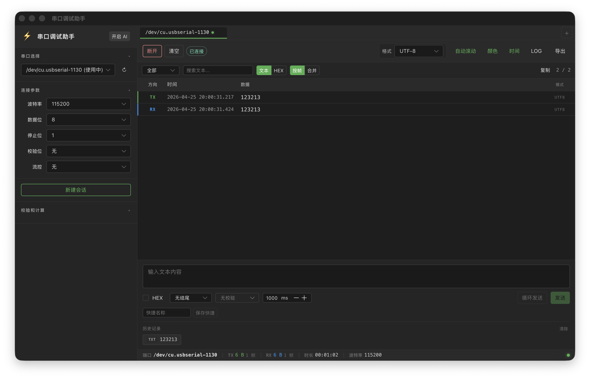
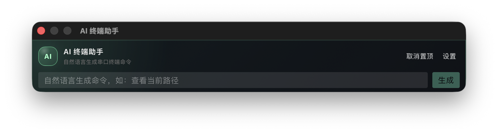

<div align="center">

# 🔌 bbcom

**Cross-Platform Serial Port Debug Assistant**

[](LICENSE)
[](https://v2.tauri.app/)
[](https://vuejs.org/)
[](https://www.rust-lang.org/)
[](https://www.typescriptlang.org/)

[English](./README.md) · [中文](./README.zh-CN.md)

</div>

---

## Overview

**bbcom** is a cross-platform desktop serial port debugging tool built with **Tauri v2 + Rust + Vue 3 + TypeScript**, designed for embedded developers' daily debugging workflows.

### Key Highlights

- 🔥 **Multi-Session** — Connect and monitor multiple serial ports simultaneously
- ⚡ **High Performance** — Virtual scrolling + RAF batch rendering stays smooth at high baud rates
- 🤖 **AI Terminal Assistant** — Natural language to shell commands, powered by ZHIPU AI
- 🎨 **Dark Theme** — Comfortable for long debugging sessions with TX/RX color-coded frames
- 💾 **Data Export** — TXT, CSV, JSONL, BIN formats
- 🔒 **CRC Checksums** — Checksum / CRC-8 / CRC-16 / CRC-32 calculation

## Screenshots

<table>
  <tr>
    <td align="center"><b>Main Window</b></td>
    <td align="center"><b>AI Assistant</b></td>
  </tr>
  <tr>
    <td></td>
    <td></td>
  </tr>
</table>

## Features

### Serial Communication

- Real-time serial data TX/RX with **HEX / ASCII / UTF-8 / ANSI** display modes
- Full serial parameter configuration: baud rate (9600 ~ 921600), data bits, stop bits, parity, flow control
- Multi-session management — connect and monitor multiple ports independently
- Hot-plug detection with automatic device list refresh
- Millisecond-precision timestamps, per-frame and merged view modes
- Cyclic sending with customizable interval (50 ms ~ 1 h)

### Data Processing

- Virtual scrolling + `requestAnimationFrame` batch rendering
- Direction-colored frames (TX green / RX blue) with direction filtering (All / TX / RX)
- Text & HEX search with debounce
- ANSI escape sequence colored rendering
- Data export: TXT (HEX/ASCII), CSV, JSONL, BIN
- Right-click context menu for quick copy (HEX / ASCII / UTF-8 / full line)

### Checksum Tools

- Checksum / CRC-8 / CRC-16 / CRC-32 calculation

### AI Terminal Assistant

- Independent floating window, always on top, draggable & resizable
- Describe intent in natural language → AI generates Linux/BusyBox commands
- Powered by ZHIPU AI (`zai-rs`), supporting GLM-5.1 / GLM-5 Turbo / GLM-4.7 / GLM-4.5 Air models
- Command risk classification (Safe / Cautious / Dangerous) with auto-blocking of dangerous commands
- Optional Coding Plan mode for improved complex command generation quality
- One-click copy or fill into the send input box

### User Experience

- Dark theme with green accent color
- Configuration persistence — auto-restore serial params, display mode, AI settings, etc.
- Keyboard shortcuts: `Ctrl+N` new session, `Ctrl+W` close session
- LRU cache for formatted results, ensuring performance with large data frames
- Send history + quick command management

## Tech Stack

| Layer | Technology |
|---|---|
| Desktop Framework | [Tauri v2](https://v2.tauri.app/) |
| Backend | [Rust](https://www.rust-lang.org/) (tokio / serde / chrono / crc / zai-rs) |
| Frontend | [Vue 3](https://vuejs.org/) Composition API + [TypeScript](https://www.typescriptlang.org/) |
| Build | [Vite 6](https://vite.dev/) |
| UI Components | [Naive UI](https://www.naiveui.com/) (Dark Theme) |
| State Management | [Pinia](https://pinia.vuejs.org/) |
| Virtual Scroll | [@tanstack/vue-virtual](https://tanstack.com/virtual) |
| ANSI Rendering | [ansi_up](https://github.com/drudru/ansi_up) |
| Linting | ESLint 9 + typescript-eslint |
| Package Manager | [pnpm](https://pnpm.io/) |

## Getting Started

### Prerequisites

- **Rust** stable (edition 2024, minimum 1.85)
- **Node.js** 18+
- **pnpm** (recommended) / npm / yarn
- Serial port access permissions on your OS

### Option 1: Using the Dev Script

```bash
chmod +x scripts/dev.sh

# Install dependencies
./scripts/dev.sh install

# Start dev environment (frontend + Tauri)
./scripts/dev.sh dev

# Build for production
./scripts/dev.sh build
```

Additional commands: `frontend` (frontend only), `tauri` (Tauri only), `lint`, `test`, `help`

### Option 2: Manual Commands

```bash
# Install dependencies
pnpm install

# Development mode
pnpm tauri:dev

# Frontend only
pnpm dev

# Production build
pnpm build          # Frontend type check + build
pnpm tauri:build    # Tauri packaging
```

### Available Scripts

| Command | Description |
|---|---|
| `pnpm dev` | Start Vite frontend dev server |
| `pnpm build` | Vue type check + Vite build |
| `pnpm preview` | Preview frontend build output |
| `pnpm tauri:dev` | Start Tauri dev mode (with frontend HMR) |
| `pnpm tauri:build` | Build production desktop installer |

## Project Structure

```
bbcom/
├── src-tauri/                  # Rust backend
│   ├── src/
│   │   ├── commands/           # Tauri IPC commands
│   │   │   ├── ai.rs           #   AI window control + command generation
│   │   │   ├── checksum.rs     #   Checksum / CRC calculation
│   │   │   ├── config.rs       #   Config loading & persistence
│   │   │   └── export.rs       #   Data export entry point
│   │   ├── models/             # Data models
│   │   │   ├── port_config.rs  #   Serial port config
│   │   │   ├── data_frame.rs   #   Data frame (TX/RX + timestamp + bytes)
│   │   │   ├── errors.rs       #   Unified error types
│   │   │   └── checksum_type.rs
│   │   ├── export/             # Export formats (TXT / CSV / JSONL / BIN)
│   │   ├── utils/              # Utilities (HEX format / checksum / timestamp)
│   │   ├── lib.rs              # App entry, window init & plugin registration
│   │   └── main.rs
│   ├── Cargo.toml
│   └── tauri.conf.json
├── src/                        # Vue 3 frontend
│   ├── components/
│   │   ├── port-selector/      # Serial port selector
│   │   ├── session-tabs/       # Session tab bar
│   │   ├── session/            # Session view
│   │   ├── send-panel/         # Send panel + AI assistant components
│   │   ├── terminal/           # Data frame list (virtual scroll)
│   │   └── status-bar/         # Status bar (TX/RX stats / connection)
│   ├── composables/            # Composable functions
│   │   ├── useSerialPort.ts    # Serial connect / listen / write
│   │   ├── useSerialData.ts    # Data frame management + RAF batch render
│   │   ├── usePortWatcher.ts   # Hot-plug monitoring
│   │   ├── useExport.ts        # Export logic
│   │   └── useSessionActions.ts
│   ├── stores/                 # Pinia stores
│   │   ├── sessions.ts         # Multi-session management
│   │   ├── serial.ts           # Serial device list
│   │   └── app.ts              # Global settings (display / AI / shortcuts)
│   ├── lib/                    # Pure TS utilities
│   │   ├── format.ts           # HEX / ASCII / UTF-8 formatting
│   │   ├── constants.ts        # Baud rate / data bits constants
│   │   ├── lru-cache.ts        # LRU cache
│   │   └── time.ts
│   ├── types/index.ts          # TypeScript type definitions
│   ├── styles/                 # CSS variables + global styles
│   ├── App.vue                 # Main window
│   ├── AiWindow.vue            # AI floating window
│   └── main.ts                 # Entry point (route: main / AI window)
├── scripts/
│   └── dev.sh                  # Dev helper script
├── images/                     # Screenshots
├── package.json
├── vite.config.ts
├── eslint.config.mjs
└── tsconfig.json
```

## Architecture

```
┌──────────────────────────────────────────────────────────┐
│  Vue 3 Frontend (Naive UI + Pinia + Virtual Scroll)      │
│  ┌───────────┐  ┌────────────┐  ┌───────────────────┐   │
│  │PortSelect  │  │SessionView │  │ AI Terminal Asst  │   │
│  └─────┬─────┘  └─────┬──────┘  └────────┬──────────┘   │
│        │               │                  │              │
│  ┌─────┴───────────────┴──────────────────┴───────────┐  │
│  │          Tauri IPC (invoke / listen / emit)         │  │
│  └───────────────────────┬────────────────────────────┘  │
├──────────────────────────┼───────────────────────────────┤
│  Rust Backend             │                               │
│  ┌────────────────────────┴───────────────────────────┐  │
│  │  commands: ai / checksum / config / export          │  │
│  ├─────────────────────────────────────────────────────┤  │
│  │  tauri-plugin-serialplugin   (serial TX/RX)         │  │
│  │  tauri-plugin-dialog         (file save dialog)     │  │
│  │  tauri-plugin-store / -fs    (persistence)          │  │
│  │  zai-rs                      (ZHIPU AI Chat API)    │  │
│  └─────────────────────────────────────────────────────┘  │
└──────────────────────────────────────────────────────────┘
```

- Serial port managed via `tauri-plugin-serialplugin`; frontend communicates with Rust backend through Tauri Command / Event
- Frontend uses `requestAnimationFrame` + data queue batch rendering for smooth UI at high baud rates
- AI assistant runs in an independent `WebviewWindow` — hidden (not destroyed) on close, synced via Tauri Event
- All configs dual-persisted through localStorage + Tauri Store

## Contributing

Contributions are welcome! Please follow these guidelines:

1. **Commit Messages** — Follow [Conventional Commits](https://www.conventionalcommits.org/)
2. **Code Style** — ESLint 9 + typescript-eslint (`no-console: warn`)
3. **Rust** — Edition 2024, `tracing` for logging, `thiserror` for error handling
4. **TypeScript** — Strict mode (`strict: true`, `noUnusedLocals`, `noUnusedParameters`)

### Development Workflow

1. Fork the repository
2. Create a feature branch (`git checkout -b feat/my-feature`)
3. Commit your changes (`git commit -m 'feat: add something'`)
4. Push to the branch (`git push origin feat/my-feature`)
5. Open a Pull Request

## FAQ

<details>
<summary><b>Which platforms are supported?</b></summary>

bbcom supports **Windows**, **macOS**, and **Linux**, thanks to Tauri v2's cross-platform architecture.
</details>

<details>
<summary><b>How do I get a ZHIPU AI API key?</b></summary>

Sign up at [open.bigmodel.cn](https://open.bigmodel.cn/) and create an API key. Enter it in the AI Assistant settings panel within bbcom.
</details>

<details>
<summary><b>Why is the serial port not showing up?</b></summary>

- Make sure the device is connected and drivers are installed
- On Linux, you may need to add your user to the `dialout` group: `sudo usermod -aG dialout $USER`
- On macOS, check `ls /dev/cu.*` in Terminal
</details>

## License

This project is licensed under the [MIT License](LICENSE).
