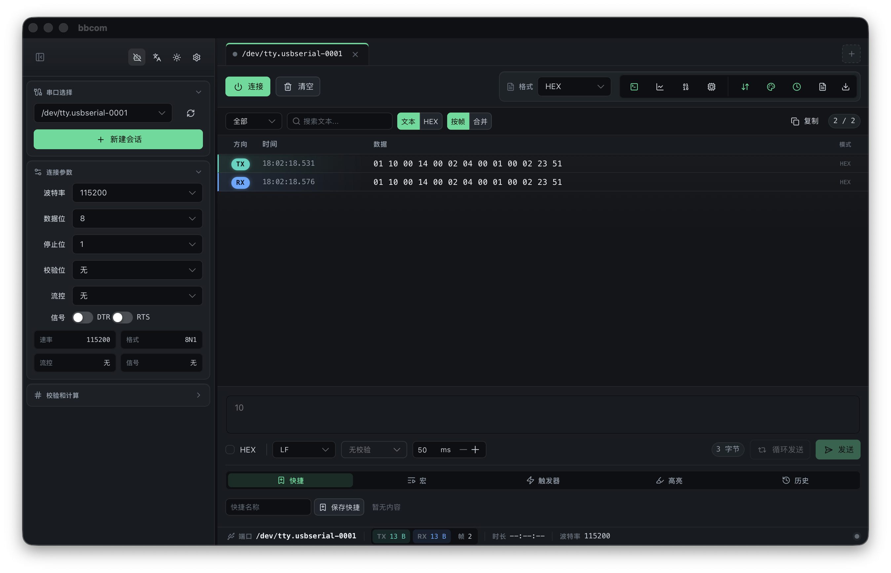
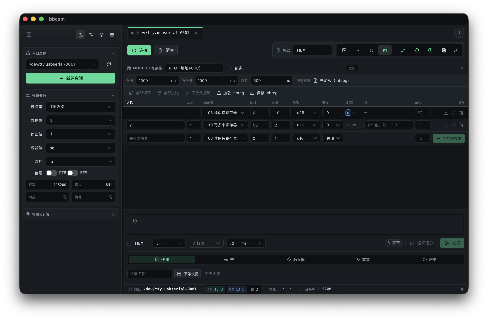
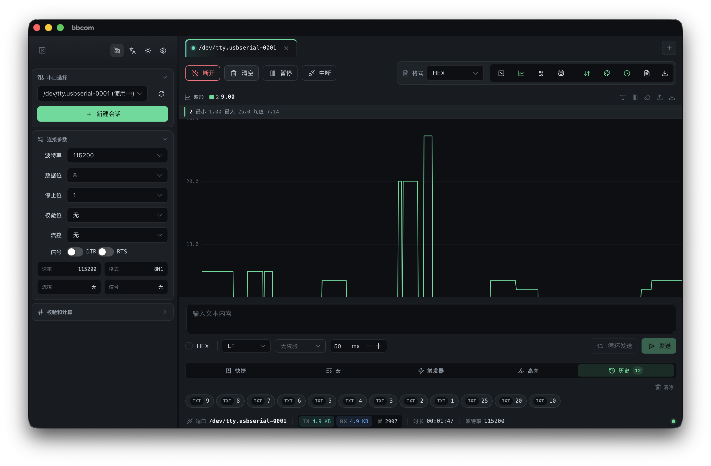

<div align="center">

# 🔌 bbcom

**跨平台桌面串口调试工具**

[](LICENSE)
[](https://v2.tauri.app/)
[](https://vuejs.org/)
[](https://www.rust-lang.org/)
[](https://www.typescriptlang.org/)

[English](./README.md) · [中文](./README.zh-CN.md)

[⬇️ 下载](https://github.com/AnlangA/bbcom/releases)

</div>

---

## 概述

**bbcom** 是一款跨平台桌面串口调试工具，基于 **Tauri v2 + Rust + Vue 3 + TypeScript** 构建，面向嵌入式开发者的日常调试场景。

### 核心亮点

- 🔥 **多会话管理** — 同时连接并监控多个串口，独立收发互不干扰
- ⚡ **高性能渲染** — 虚拟滚动 + 批量渲染，高波特率下 UI 流畅不卡顿
- 🤖 **AI 终端助手** — 自然语言描述意图，AI 自动生成终端命令
- 📊 **波形可视化** — 解析 RX 数值实时绘图，Arduino Serial Plotter 风格
- 🛠️ **Modbus 主站** — RTU/PDU 传输，FC01-FC10 批量轮询读写，寄存器可绑定波形通道
- 🎨 **深色/浅色主题** — TX/RX 方向着色，一键切换，长时间调试更舒适
- 💾 **数据导出** — 支持 TXT、CSV、JSONL、BIN 四种格式
- 🔒 **校验工具** — Checksum / CRC-8 / CRC-16 / CRC-32 计算
- 🌐 **中英双语** — 界面语言一键切换，偏好持久化

## 截图

<table>
  <tr>
    <td align="center"><b>主窗口</b></td>
    <td align="center"><b>AI 助手</b></td>
  </tr>
  <tr>
    <td></td>
    <td></td>
  </tr>
  <tr>
    <td align="center"><b>Modbus 寄存器</b></td>
    <td align="center"><b>波形绘图</b></td>
  </tr>
  <tr>
    <td></td>
    <td></td>
  </tr>
</table>

## 功能

### 串口通信

- 实时串口数据收发，支持 **HEX / ASCII / UTF-8 / ANSI / HEX+ASCII** 五种显示模式（HEX+ASCII 双视图：左侧 HEX 对、右侧 ASCII，每行 16 字节，不可见字符显示为点）
- 完整的串口参数配置：波特率（9600 ~ 921600）、数据位、停止位、奇偶校验、流控
- 多会话管理 — 同时连接并监控多个串口，独立收发互不干扰
- 最近会话捕获自动恢复（重启后保留最近日志，串口不会自动重连），通过**版本化持久化迁移链**保证旧数据向前兼容
- 热插拔检测，串口设备列表自动刷新
- 毫秒级精确时间戳，按帧/合并两种查看模式
- 循环发送，可自定义间隔（50ms ~ 1h）
- **带控制流的宏命令序列** — 除 `send`/`delay` 外，支持 `wait`（等待 RX 模式并支持超时）、`if`/`else`（依据最近 RX 条件分支）、`goto`/`label`（跳转），以及 `maxSteps` 防死循环。完整的 Tera Term TTL 风格引导脚本
- **宏库导入/导出（JSON）** — 跨会话、跨机器共享脚本序列
- **连接预设** — 保存并复用命名的串口配置（波特率/数据位/停止位/校验/流控/DTR/RTS）
- **BREAK 信号**（250ms）— 一键 Arduino 自动复位 / ESP32 进入下载模式
- DTR/RTS 握手线控制，用于选择启动模式
- **大写入分块** — TX 负载拆分为 ≤4 KiB 分块并带指数退避重试，避免 release 构建下串口插件截断大写入
- **波形可视化** — 解析 RX 中的数值（逗号/空格/分号分隔）并实时滚动绘图，Arduino Serial Plotter / serial-studio 风格；支持暂停/继续、通道显隐、最小/最大/均值统计、Y 轴自动坐标、清空与一键 CSV 导出
- **协议解析模板** — 按分隔符（CRLF/自定义 HEX）、定长、长度字段头重组 RX 字节流为独立帧；点击单帧查看 HEX+ASCII 详情，文本筛选与帧/字节/吞吐量统计；内置 NMEA 0183、AT/Modem、SCPI/仪器、长度前缀（1B/2B BE+LE）、NUL 分隔二进制等预设
- **`.bbrec` 录制/回放** — 将裸 RX/TX 字节流录制为版本化 JSONL 文件，之后可通过任意协议引擎回放（用不同配置重新解析历史捕获，或用作回归数据）
- **Modbus 主站** — RTU（地址+PDU+CRC）与 PDU（裸 PDU，TCP 网关风格）两种传输；支持 FC01-FC04 读、FC05/06 写单、FC10 写多；连续地址自动批量，值类型覆盖 bool/u8/i8/u16/i16/u32/i32/f32（BE+LE）；可配置轮询/写间隔与超时，每行独立启用周期读（R）或周期写（W）；寄存器可绑定到 0-7 号波形通道实时绘图；支持 `.bbreg` 配置导入/导出、批量 Read all / Send all、以及按数据源的 Replay 流回放
- **工具横栏** — 快捷命令、宏、触发器、高亮、历史统一在一个紧凑的横栏标签页中切换（带数量徽标），取代原先的折叠塔式布局
- **视图切换** — 终端、波形、协议解析三种视图互斥切换（工具栏一键切换），不再堆叠挤占终端高度
- **脚本触发器** — RX 文本或 HEX 匹配后自动发送响应，带冷却时间防止循环触发
- **实时状态指标** — 除累计收发字节数与 B/s 速率外，状态栏还显示 frames/s、缓冲区填充率（%）以及累计丢字节数（仅 > 0 时显示）
- **自动更新检查** — 通过 `tauri-plugin-updater` 可选的更新通知（未配置端点时优雅返回"无更新"）
- **深色/浅色主题** — 侧边栏一键切换
- **中英双语** — 界面语言一键切换，偏好持久化

### 数据处理

- 虚拟滚动（`@tanstack/vue-virtual`）+ `requestAnimationFrame` 批量渲染，高波特率下 UI 流畅不卡顿
- `SerialRxQueue` O(1) 环形缓冲（头索引丢弃 + 周期压实），高波特率下保持流畅且内存不无限增长
- 数据帧按方向着色（TX 绿 / RX 蓝），支持方向过滤（全部 / TX / RX）
- 文本搜索 & HEX 搜索，带防抖
- 会话级关键词高亮：支持 TXT/HEX 模式、全部/TX/RX 范围和颜色标记
- ANSI 转义序列着色渲染
- 数据导出：TXT（HEX / ASCII）、CSV、JSONL、BIN 四种格式 —— 大体量导出通过写入临时捕获文件由 Rust 端读回（F12 旁路），10 万帧导出依旧流畅
- **时间范围 / 方向导出过滤** — 仅导出 `[startMs, endMs)` 区间内的帧，可选限制为仅 TX 或 RX
- 右键菜单快速复制 HEX / ASCII / UTF-8 / 完整行

### 校验工具

- Checksum / CRC-8 / CRC-16 / CRC-32 校验计算

### AI 终端助手

- 独立悬浮窗口，始终置顶，可拖拽、可调整大小
- 自然语言描述意图，AI 自动生成 Linux/BusyBox 终端命令
- 基于 ZHIPU AI（`zai-rs`），支持 GLM-5.1 / GLM-5 Turbo / GLM-4.7 / GLM-4.5 Air 模型，通过静态 match 表分派（非 `Box<dyn Model>`，模型选择 dyn-safe）
- **流式响应** — 增量 SSE delta 累加为完整回复，支持 keep-alive 处理与中途中止
- 命令风险分级（安全 / 谨慎 / 危险），危险命令自动拦截
- 串口日志分析助手，基于当前会话上下文提取依据和建议
- 可选启用 Coding Plan 模式，提升复杂命令的生成质量
- 生成结果一键复制或填入发送输入框

### 用户体验

- 深色/浅色主题，绿色主色调，侧边栏一键切换
- 配置持久化 — 自动恢复上次串口参数、显示模式、协议解析模板、Modbus 配置、AI 设置和最近会话捕获
- 快捷键：`Ctrl+N` 新建会话、`Ctrl+W` 关闭会话、`Ctrl+L` 清空、`Esc` 暂停/继续捕获、`Ctrl+Enter` 发送
- LRU 缓存格式化结果，保证大量数据帧下的渲染性能
- 发送历史记录 + 快捷指令管理
- 中英双语界面，语言偏好持久化

## 技术栈

| 层级      | 技术                                                                                        |
| --------- | ------------------------------------------------------------------------------------------- |
| 桌面框架  | [Tauri v2](https://v2.tauri.app/)                                                           |
| 后端      | [Rust](https://www.rust-lang.org/)（tokio / serde / chrono / crc / zai-rs）                 |
| 前端      | [Vue 3](https://vuejs.org/) Composition API + [TypeScript](https://www.typescriptlang.org/) |
| 构建      | [Vite 6](https://vite.dev/)                                                                 |
| UI 组件库 | [Naive UI](https://www.naiveui.com/)（Dark Theme）                                          |
| 状态管理  | [Pinia](https://pinia.vuejs.org/)                                                           |
| 虚拟滚动  | [@tanstack/vue-virtual](https://tanstack.com/virtual)                                       |
| ANSI 渲染 | [ansi_up](https://github.com/drudru/ansi_up)                                                |
| 自动更新  | [tauri-plugin-updater](https://v2.tauri.app/plugin/updater/)                                |
| 基准测试  | [criterion](https://bheisler.github.io/criterion.rs/)（Rust）+ node:test（前端）            |
| 代码规范  | ESLint 9 + typescript-eslint                                                                |
| 测试覆盖  | [c8](https://github.com/bcoe/c8)（前端）+ cargo-tarpaulin（Rust）                           |
| 依赖图    | [madge](https://github.com/dependents/madge)（循环依赖门）                                  |
| 包管理    | [pnpm](https://pnpm.io/)                                                                    |

## 快速开始

### 环境要求

- **Rust** stable（edition 2024，最低 1.85）
- **Node.js** 22+
- **pnpm** 10+
- 操作系统串口访问权限

### 方式一：使用开发脚本

```bash
chmod +x scripts/dev.sh

# 安装依赖
./scripts/dev.sh install

# 启动开发环境（前端 + Tauri）
./scripts/dev.sh dev

# 构建生产包
./scripts/dev.sh build
```

其他命令：`frontend`（仅前端）、`tauri`（仅 Tauri）、`lint`、`test`、`help`

### 方式二：手动命令

```bash
# 安装依赖
pnpm install

# 开发模式
pnpm tauri:dev

# 仅前端
pnpm dev

# 生产构建
pnpm build          # 前端类型检查 + 构建
pnpm tauri:build    # Tauri 打包
```

### 可用脚本

| 命令                     | 说明                                               |
| ------------------------ | -------------------------------------------------- |
| `pnpm dev`               | 启动 Vite 前端开发服务器                           |
| `pnpm build`             | Vue 类型检查 + Vite 构建                           |
| `pnpm preview`           | 预览前端构建产物                                   |
| `pnpm tauri:dev`         | 启动 Tauri 开发模式（含前端热重载）                |
| `pnpm tauri:build`       | 构建生产桌面安装包                                 |
| `pnpm format`            | 格式化前端 + Rust 代码                             |
| `pnpm format:check`      | 检查格式（不写入）                                 |
| `pnpm lint`              | 使用 ESLint 9 对前端进行 lint                      |
| `pnpm test:frontend`     | 使用 Node test runner 运行前端单元测试             |
| `pnpm test:rust`         | 运行 Rust 单元测试                                 |
| `pnpm test`              | 运行前端 + Rust 单元测试                           |
| `pnpm coverage:frontend` | 在 `c8` 覆盖率门下运行前端测试（`.c8rc.json`）     |
| `pnpm coverage:lib`      | 逐文件 `c8` 门：每个 `src/lib/` 文件行覆盖率 ≥ 90% |
| `pnpm bench:frontend`    | 运行前端热路径微基准（回归门控）                   |
| `pnpm bench:frontend:write` | 在有意优化后重写前端基准基线                      |
| `pnpm bench:rust`        | 运行 Rust `criterion` 基准（CRC、导出）            |
| `pnpm cycles`            | 检测循环依赖（madge）                              |
| `pnpm check`             | 运行格式检查、lint、build 和全部测试               |

## 性能基准

热路径由回归门控基准覆盖，性能回退会让 CI 像测试失败一样失败：

- **前端**（`pnpm bench:frontend`，`tests/frontend/perf.bench.ts`）—— 测量每帧格式化流水线（`formatHex` / `formatUtf8`）、RX flush 的 `concatUint8Arrays`、MERGED 视图重建、LRU 格式缓存命中率、`SerialRxQueue` 溢出丢弃路径、5 万帧会话推送、Modbus 读批量组装。基线存于 `tests/frontend/.perf-baseline.json`（机器本地，git-ignored）；有意优化后用 `pnpm bench:frontend:write` 刷新。回退 > 15% 即失败。
- **Rust**（`pnpm bench:rust`，`src-tauri/benches/hot_paths.rs`）—— `criterion` 基准：校验和算法（sum8 / CRC-8 / CRC-16 / CRC-32）、`format_hex`、导出格式化（JSONL / TXT-HEX，1k 与 10k 帧）。带统计置信的 ns/µs/ms 报告。
- **单元测试** —— 576 个前端测试（`pnpm test:frontend`，node:test 运行器）+ 71 个 Rust 测试（`pnpm test:rust`，含跨语言 IPC 契约测试），0 循环依赖（`pnpm cycles`），85% 行 / 88% 分支覆盖率门（`pnpm coverage:frontend`，`src/lib/` 另有更严格的 ≥ 90% 逐文件门）。
- **打包** —— `ANALYZE=1 pnpm build` 生成 `dist/stats.html`（treemap）用于 chunk 体积审计。

## 项目结构

```
bbcom/
├── src-tauri/                  # Rust 后端
│   ├── src/
│   │   ├── commands/           # Tauri IPC 命令
│   │   │   ├── ai/             #   AI 命令生成 + 日志分析
│   │   │   │                     (mod/cooldown/prompts/service/parser/types/tests)
│   │   │   ├── checksum.rs     #   校验和 / CRC 计算
│   │   │   ├── export.rs       #   数据导出入口（含 F12 捕获文件旁路）
│   │   │   ├── log.rs          #   无状态 append_log（自动日志 / 导出 JSONL）
│   │   │   ├── updater.rs      #   check_for_updates（tauri-plugin-updater 封装）
│   │   │   ├── window.rs       #   AI 助手窗口命令
│   │   │   ├── ipc_contracts.rs      # 跨语言 IPC 线缆契约测试
│   │   │   └── window_contracts.rs   # AI 窗口命令契约测试
│   │   ├── models/             # 数据模型
│   │   │   ├── data_frame.rs   #   数据帧（TX/RX + 时间戳 + 字节数据）
│   │   │   ├── errors.rs       #   统一错误类型（thiserror）
│   │   │   └── checksum_type.rs
│   │   ├── export/             # 导出格式实现（TXT / CSV / JSONL / BIN）
│   │   ├── utils/              # 工具函数（HEX 格式化 / 校验 / 时间戳）
│   │   ├── lib.rs              # 应用入口，窗口初始化与插件注册
│   │   └── main.rs
│   ├── benches/hot_paths.rs    # criterion 基准（校验和 / 格式化 / 导出）
│   ├── Cargo.toml
│   └── tauri.conf.json
├── src/                        # Vue 3 前端
│   ├── components/
│   │   ├── port-selector/      # 串口选择器（+ 连接预设）
│   │   ├── session-tabs/       # 会话标签栏
│   │   ├── session/            # 会话视图（SessionView + SessionToolbar）
│   │   ├── send-panel/         # 发送面板 + AI 助手组件
│   │   ├── terminal/           # 数据列表 + 协议面板（虚拟滚动）
│   │   │                        (DataPacketList, ModbusPanel + Header/AddForm/RegisterRow,
│   │   │                         ParserPanel + ConfigBar/StatsBar/FrameDetail, WaveformPanel + Legend)
│   │   ├── ai/                 # AI 悬浮窗口面板
│   │   ├── app-shell/          # 顶层应用外壳 + 侧边栏
│   │   └── status-bar/         # 状态栏（收发统计 / frames/s / 缓冲区 / 丢字节）
│   ├── composables/            # 组合式函数
│   │   ├── useSerialConnection.ts # 串口连接 / 监听 / 写入（TX 单序列化）
│   │   ├── useSessionFrames.ts # 会话数据帧操作
│   │   ├── useSessionModbus.ts # Modbus 主站编排
│   │   ├── useModbusMaster.ts  # Modbus 单忙 / 单挂起 RX 守卫
│   │   ├── useAutoLog.ts       # 每会话 append_log 顺序链
│   │   ├── useTriggers.ts      # 脚本化 RX→TX 触发器（带冷却）
│   │   ├── usePacketFilter.ts  # 方向过滤 / 搜索 / 合并视图
│   │   ├── usePacketFormatter.ts # HEX / 文本 / ANSI 格式化缓存
│   │   ├── useExport.ts        # 导出逻辑（F12 捕获文件旁路）
│   │   ├── usePortWatcher.ts   # 热插拔监听
│   │   └── useSessionActions.ts
│   ├── stores/                 # Pinia 状态
│   │   ├── sessions.ts         # 多会话管理（shallowRef + notifyFramesChanged）
│   │   ├── serial.ts           # 串口设备列表
│   │   └── app.ts              # 全局设置（显示模式 / AI 配置 / 快捷键）
│   ├── lib/                    # 纯 TS，无框架依赖的领域逻辑
│   │   ├── modbus/             # Modbus 桶（15 模块：core/pdu/transport/
│   │   │                        registers/master-runtime）
│   │   ├── format.ts           # HEX / ASCII / UTF-8 / HEX+ASCII 格式化
│   │   ├── bytes.ts            # Uint8Array 拼接
│   │   ├── waveform.ts         # 波形解析 / 通道统计
│   │   ├── waveform-viewport.ts# 视口变换（normalize/zoom/scale/pan）
│   │   ├── waveform-render.ts  # 画布渲染流水线（无框架依赖）
│   │   ├── protocol-parser.ts  # 分隔符/定长/长度字段重组为帧
│   │   ├── protocol-engine.ts  # 传输无关的 ProtocolEngine 接口
│   │   ├── bbrec.ts            # .bbrec 裸字节流录制 / 回放
│   │   ├── macro-control-flow.ts # 扩展宏（wait/if/goto/label）
│   │   ├── macro-library.ts    # 宏库导入 / 导出（JSON）
│   │   ├── trigger-engine.ts   # RX 子串 / HEX 匹配触发引擎
│   │   ├── serial-rx-queue.ts  # O(1) 环形缓冲（头索引丢弃）
│   │   ├── write-chunking.ts   # ≤4 KiB TX 分块 + 重试（F8）
│   │   ├── export-filters.ts   # 时间范围 / 方向导出过滤
│   │   ├── ai-models.ts        # AI 模型注册表（分发表镜像）
│   │   ├── ai-stream.ts        # SSE 增量累加器（F14）
│   │   ├── session-persistence.ts # 版本化迁移链（COW-5）
│   │   ├── connection-presets.ts # 命名串口配置
│   │   ├── logger.ts           # 结构化前端日志
│   │   ├── ipc.ts              # 类型化 Tauri 命令封装
│   │   ├── secure-settings.ts  # 基于 Tauri Store 的本地密钥设置
│   │   ├── constants.ts        # 波特率 / 数据位等常量
│   │   ├── serial-utils.ts     # 串口路径 / 列表工具
│   │   ├── serial-config.ts    # 串口配置 → 枚举映射
│   │   ├── lru-cache.ts        # LRU 缓存
│   │   └── locales/            # i18n 目录（en.ts / zh.ts / catalog.ts）
│   ├── types/                  # 按领域拆分的 TS 类型桶
│   │   ├── index.ts            #   重导出桶
│   │   ├── display.ts serial.ts macros.ts modbus.ts
│   │   ├── waveform.ts ai.ts session.ts checksum.ts constants.ts
│   ├── styles/                 # CSS 变量（283 token）+ 全局样式
│   ├── App.vue                 # 主窗口
│   ├── AiWindow.vue            # AI 悬浮窗口
│   └── main.ts                 # 入口（路由分发主窗口 / AI 窗口）
├── scripts/
│   └── dev.sh                  # 开发辅助脚本
├── tests/frontend/             # 前端单元测试（72 个文件，node:test 运行器）
│   └── perf.bench.ts           #   回归门控微基准
├── docs/                       # 补充文档（如高波特率测量）
├── images/                     # 截图
├── .github/workflows/          # ci.yml（lint/build/test/coverage/cycles）+ release.yml
├── .c8rc.json                  # c8 覆盖率门（85% 行 / 88% 分支）
├── package.json
├── vite.config.ts
├── eslint.config.mjs
└── tsconfig.json
```

## 架构概览

```
┌──────────────────────────────────────────────────────────┐
│  Vue 3 前端 (Naive UI + Pinia + Virtual Scroll)          │
│  ┌───────────┐  ┌────────────┐  ┌───────────────────┐   │
│  │串口选择器   │  │ 会话视图    │  │  AI 终端助手      │   │
│  └─────┬─────┘  └─────┬──────┘  └────────┬──────────┘   │
│        │               │                  │              │
│  ┌─────┴───────────────┴──────────────────┴───────────┐  │
│  │          Tauri IPC (invoke / listen / emit)         │  │
│  └───────────────────────┬────────────────────────────┘  │
├──────────────────────────┼───────────────────────────────┤
│  Rust 后端                │                               │
│  ┌────────────────────────┴───────────────────────────┐  │
│  │  commands: ai / checksum / export / log / updater   │  │
│  │            window                                   │  │
│  ├─────────────────────────────────────────────────────┤  │
│  │  tauri-plugin-serialplugin   (串口收发)              │  │
│  │  tauri-plugin-dialog         (文件保存对话框)         │  │
│  │  tauri-plugin-store          (本地设置)               │  │
│  │  tauri-plugin-updater        (自动更新检查)           │  │
│  │  zai-rs                      (ZHIPU AI Chat API)    │  │
│  └─────────────────────────────────────────────────────┘  │
└──────────────────────────────────────────────────────────┘
```

- 串口通过 `tauri-plugin-serialplugin` 管理，前端通过 Tauri Command / Event 与 Rust 后端通信
- 前端持有全部会话状态与协议引擎（Modbus、解析器、波形）；Rust 端只是无状态的 IPC + 文件系统 + AI 客户端薄层
- 前端使用 `requestAnimationFrame` + 有界 O(1) 环形缓冲（`SerialRxQueue`）确保高波特率下 UI 流畅；`sessions` store 采用 `shallowRef`，5 万帧捕获依旧可交互
- TX 经单一 `writeChain` promise 串行化，确保多个并发发送者（循环发送、宏、触发器、AI 填充、Modbus）不会在串口上交错写入
- 持久化为版本化 —— 每次加载都运行 `migratePersistedFile` 迁移链，持久化结构变更保持向前兼容
- AI 助手为独立 `WebviewWindow`，关闭时隐藏而非销毁，通过 Tauri Event 同步窗口状态；响应以 SSE delta 流式返回
- 应用设置本地持久化；AI API Key 会从旧 localStorage 迁移到 Tauri Store

> 完整的模块拓扑、不可违反的不变量（"sacred cows"）、上游硬约束与人工验证清单，
> 详见 [ARCHITECTURE.md](./ARCHITECTURE.md)。

## 贡献指南

欢迎贡献！请遵循以下规范：

1. **提交信息** — 遵循 [Conventional Commits](https://www.conventionalcommits.org/)
2. **代码风格** — ESLint 9 + typescript-eslint（`no-console: error`、`eqeqeq: error`）
3. **Rust** — edition 2024，`tracing` 日志，`thiserror` 错误处理
4. **TypeScript** — 严格模式（`strict: true`、`noUnusedLocals`、`noUnusedParameters`）
5. **检查** — 发起 PR 前运行 `pnpm check`

### 开发流程

1. Fork 本仓库
2. 创建功能分支（`git checkout -b feat/my-feature`）
3. 提交更改（`git commit -m 'feat: add something'`）
4. 推送到分支（`git push origin feat/my-feature`）
5. 发起 Pull Request

## 常见问题

<details>
<summary><b>支持哪些平台？</b></summary>

bbcom 支持 **Windows**、**macOS** 和 **Linux**，得益于 Tauri v2 的跨平台架构。

</details>

<details>
<summary><b>如何获取 ZHIPU AI API Key？</b></summary>

在 [open.bigmodel.cn](https://open.bigmodel.cn/) 注册并创建 API Key，然后在 bbcom 的 AI 助手设置面板中填入即可。

</details>

<details>
<summary><b>串口设备不显示怎么办？</b></summary>

- 确认设备已连接且驱动已安装
- Linux 下可能需要将用户加入 `dialout` 组：`sudo usermod -aG dialout $USER`
- macOS 下可在终端执行 `ls /dev/cu.*` 检查设备
</details>

## 许可证

本项目基于 [MIT License](LICENSE) 开源。
